# 02 · FILE records and fixups

[Reference index](README.md) · [Previous](01-volume.md) · [Next](03-attributes.md)

A FILE record is a protected container for attribute records. Its record number
locates a slot; its sequence number distinguishes successive objects occupying
that slot. Its USA marker serves a different purpose: detecting a mixed
multi-sector transfer.

## FILE header

Offsets are relative to the restored FILE record. The common header ends at
`0x2A`; the optional modern extension is separate. Microsoft's
[FILE_RECORD_SEGMENT_HEADER](https://learn.microsoft.com/en-us/windows/win32/devnotes/file-record-segment-header)
defines the principal fields. The full named field map uses
[original FILE-record research](https://flatcap.github.io/linux-ntfs/ntfs/concepts/file_record.html)
and our `ntfs_disk_record`/`ntfs_disk_record_extension`.

| Offset | Width | Field | Meaning |
| --- | --- | --- | --- |
| `0x00` | 4 | `mst.magic` | `FILE` |
| `0x04` | 2 | `mst.usa_offset` | Update-sequence array's byte offset |
| `0x06` | 2 | `mst.usa_count` | Array length in 16-bit words, including the marker |
| `0x08` | 8 | `lsn` | Log sequence associated with the record |
| `0x10` | 2 | `sequence` | File-reference generation |
| `0x12` | 2 | `links` | Stored link count; preserve physical filename relationships |
| `0x14` | 2 | `attrs_offset` | First attribute record |
| `0x16` | 2 | `flags` | Includes in-use `0x0001` and directory `0x0002` |
| `0x18` | 4 | `used` | Used container bytes |
| `0x1C` | 4 | `allocated` | FILE container size, not the file's data allocation |
| `0x20` | 8 | `base_reference` | Zero for a base record; owning reference for an extension |
| `0x28` | 2 | `next_instance` | Next attribute-instance identifier |
| `0x2A` | 2 | Extension `reserved` | Present in the modern extension |
| `0x2C` | 4 | Extension `record_number` | Present in the modern extension |

The USA location and first attribute location are declared, not fixed constants.
An old common-only header must not be rejected because the next bytes are a USA
instead of a modern record-number extension. The attribute sequence ends with
the four-byte type `0xFFFFFFFF`; that terminator is not a full attribute header.

## File references

For the common 64-bit MFT reference:

```text
record_number = reference & 0x0000FFFFFFFFFFFF
sequence      = reference >> 48
```

**Authored example:** `0x0007000000000015` selects record 21 with sequence 7.
Finding slot 21 is insufficient: sequence 6 names a stale generation, even if
the new object happens to have the same filename. Microsoft documents the
[sequence-bearing MFT reference](https://learn.microsoft.com/en-us/windows/win32/devnotes/mft-segment-reference).

A free slot is not necessarily all zeroes. It may retain a well-formed retired
FILE image. Damaged USA or malformed headers remain corruption; the absence of
the in-use flag does not license a writer to discard damaged framing and silently
reuse the slot. Extension references additionally need base-owner and
attribute-instance validation.

### Retirement preserves stored metadata

**Observed:** a retained Windows-created capture has five Deallocate FILE packets
whose common-header LSN exactly matches the current protected FILE's `lsn`.
The packet's Initialize inverse contains the original first 24 FILE bytes.
Comparing that prefix with the matched home shows `sequence` advancing from
1 to 2 or from 2 to 3, `flags` becoming zero, and `links` staying unchanged.
One matched record retains two links. The MFT allocation bit is clear in each
matched case. A nonzero stored link count therefore does not make a retired
record live.

The other 28 deallocation packets in that capture refer to homes with a different
LSN and cannot prove this transition: the slot may have been reused or changed.
The [read-only observation command](../../scripts/observe_native_retirement.py)
checks the original MFT map, target LCN/slot, protected home, exact LSN and bitmap
before retaining a match. It does not select the current journal history.

**Verified here:** ordinary private retirement clears flags and the owning MFT
bitmap bit, advances the generation, and retains links, attribute bodies and
other logical bytes. Sequence wrap skips zero in the current C policy; that
boundary has independent local vectors, not a native witness in these five
matched records. Node publication still rejects retired and stale references.



[Diagram source](diagrams/file-retirement.mmd) ·
[Native operation and inverse units](09-logfile.md#file-retirement-a-header-inverse)

The captured native home supplies the body for private inverse/redo arithmetic;
it is not an independently captured pre-retirement body. The observation proves
the matched header transition and the stored inverse's extent. Complete metadata
rollback also needs allocation and directory updates under one owning journal
transaction.

## Multi-sector protection

FILE, INDX, RSTR and RCRD records use an update-sequence array. The mechanism is
described in [original fixup research](https://flatcap.github.io/linux-ntfs/ntfs/concepts/fixup.html)
and [Microsoft's MULTI_SECTOR_HEADER](https://learn.microsoft.com/en-us/windows/win32/devnotes/multi-sector-header).
Machlin's supported protection stride is **512 bytes**, independently of the
device's physical transfer alignment.


[Diagram source](diagrams/fixups.mmd)

For a protected record of `B` bytes with stride `S`:

```text
usa_count = B / S + 1
sector_tail(i) = i × S - 2       for i = 1 .. B/S
```

`USA[0]` is the transfer marker. `USA[i]` saves the original 16-bit word at
sector `i`'s tail. On disk, each tail contains the marker instead of the saved
word. Reading first verifies **every** tail, then restores the saved words. A
failure must not leave a partly restored public record.

**Authored example:** a 1024-byte FILE with marker `0xAA55` and restored tails
`0x1122`, `0x3344` stores the USA words `AA55, 1122, 3344`. The protected tail
bytes at `0x1FE` and `0x3FE` are both `55 AA`. Successful restoration returns
`22 11` and `44 33` at those locations.

## Writer-specific guard

Incrementing a marker and resealing a private record produces valid complete
bytes. It does not automatically detect every old/new sector mixture. Our write
guard chooses a marker absent from the actual predecessor's sector tails and
plausible old USA markers. The predecessor must come from the exact physical
location under exclusive ownership.

A MFTMirr replica has its own physical predecessor. The ordinary planner guards
the primary and mirror independently. Its tests deliberately give the old mirror
the marker that primary-only preparation would reuse, then require every mixed
old/new sector pair to fail restoration. At bootstrap, both MFT zero copies are
fully restored and compared except for their independent two-byte `USA[0]`
counters. Every other restored byte, including USA geometry and saved tails,
still has to match; a changed FILE LSN remains a corrupt mount.

Machlin's reader rejects marker zero and `0xFFFF`; its encoder skips those
reserved values. Those are our supported framing rules, rather than a claim
about every historical NTFS implementation. USA detects the guarded torn-sector
model; it is not a checksum, cryptographic integrity or arbitrary corruption
detector.

## Implementation and evidence

- Restoration and FILE validation: [record.c](../../core/record.c).
- Private protection: [mst.c](../../core/mst.c), [record.h](../../include/ntfs/record.h).
- Actual-predecessor guard: [write_journal.c](../../core/write_journal.c).
- Independent full records: [record_protect_fixtures.py](../../tests/record_protect_fixtures.py).
- Mixed-sector and unchanged-error checks: [record_protect.c](../../tests/record_protect.c).
- Ordinary retirement and node identity: [write_namespace.c](../../core/write_namespace.c),
  [write_mutation.c](../../tests/write_mutation.c).
- Private native retirement programs: [write_retirement.h](../../core/write_retirement.h),
  [write_retirement.c](../../core/write_retirement.c),
  [independent wire/state author](../../tests/write_retirement_fixtures.py) and
  [exact program/inverse/refusal tests](../../tests/write_retirement.c).

Native writer/recovery tests exercise selected torn-sector FILE and journal
states. Their exact scope and expected native warnings are recorded in
[NATIVE-WRITE-JOURNAL.md](../NATIVE-WRITE-JOURNAL.md).
