# 03 · Attributes

[Reference index](README.md) · [Previous](02-records-and-fixups.md) · [Next](04-mapping-pairs.md)

A file is described by attribute records, not by a single fixed inode structure.
The attribute type, optional UTF-16 name, instance and extent identify the
particular value. Resident values live in FILE bytes; nonresident values live in
clusters reached through mapping pairs.

[Diagram source](diagrams/attributes.mmd)

## Common attribute header

Offsets are relative to the attribute record. The common prefix is 16 bytes,
followed by a resident or nonresident form. Microsoft's
[ATTRIBUTE_RECORD_HEADER](https://learn.microsoft.com/en-us/windows/win32/devnotes/attribute-record-header)
supplies the principal field relationships; our byte layout is
`ntfs_disk_attr` in [disk.h](../../core/disk.h).

| Offset | Width | Field | Meaning |
| --- | --- | --- | --- |
| `0x00` | 4 | `type` | Attribute type code |
| `0x04` | 4 | `length` | Complete attribute record, including header and padding |
| `0x08` | 1 | `nonresident` | Form: resident 0, nonresident 1 |
| `0x09` | 1 | `name_length` | UTF-16 units in the optional attribute name |
| `0x0A` | 2 | `name_offset` | Name relative to this attribute |
| `0x0C` | 2 | `flags` | Compression, sparse and encryption storage flags |
| `0x0E` | 2 | `instance` | Attribute identifier within its FILE record |

Attribute records use eight-byte alignment. A contained attribute's declared
length must fit the FILE's used region and leave room for its selected form.
Names, values and mapping pairs need separate complete bounds checks.

## Creation times and filename caches

Microsoft defines [FILETIME](https://learn.microsoft.com/en-us/windows/win32/api/minwinbase/ns-minwinbase-filetime)
as a 64-bit count of 100-nanosecond intervals since 1601-01-01 UTC. The four
ordinary object fields are `created`, `modified`, `changed` and `accessed` in
`ntfs_disk_standard`. `ntfs_disk_filename` carries corresponding cached fields,
alongside the parent reference and name; the directory index stores that filename
value. These are distinct storage locations, not four additional object clocks.

[Diagram source](diagrams/creation-times.mmd)

Our creation request selects each supplied field independently. An omitted field
uses the operation time; the same resolved values enter the new SI and both
filename representations. Updating the parent namespace changes the parent at
the operation time, even when the child requests an older creation timestamp.
The complete new FILE and directory publication participate in the same prepared
journal operation. This policy describes our creation implementation; native NTFS
may refresh filename caches differently on later operations.

The platform conversion accepts the 1601 epoch through the selected signed
FILETIME ceiling, checks normalized nanoseconds and truncates their fraction to
100-ns ticks. Dates before 1970 remain representable. These storage units do not
claim that automatic Windows access-time updates occur at 100-ns intervals.
Independent local tests exercise four different times, each partial selection,
epoch boundaries, newly reopened SI/filename bytes and pre-I/O refusal. Installed
creation remains a separate acceptance gate.

Implementation: [write_namespace.c](../../core/write_namespace.c),
[write_mutation.h](../../core/write_mutation.h) and
[NTFSImageVolume.m](../../adapters/fskit/NTFSImageVolume.m).
Tests: [write_mutation_owner.c](../../tests/write_mutation_owner.c) and
[fskit_image_volume.m](../../tests/fskit_image_volume.m).

## Important type codes

| Type | Name | Role |
| --- | --- | --- |
| `0x10` | `$STANDARD_INFORMATION` | Object times, flags and modern security/quota fields |
| `0x20` | `$ATTRIBUTE_LIST` | References to attribute records and extents |
| `0x30` | `$FILE_NAME` | One stored parent/name relationship and cached metadata |
| `0x40` | `$OBJECT_ID` | Link-tracking identity; deeper interpretation remains open here |
| `0x50` | `$SECURITY_DESCRIPTOR` | Per-file security descriptor |
| `0x60` | `$VOLUME_NAME` | Volume label |
| `0x70` | `$VOLUME_INFORMATION` | NTFS version and volume flags |
| `0x80` | `$DATA` | An unnamed or named data stream |
| `0x90` | `$INDEX_ROOT` | Resident root of an index |
| `0xA0` | `$INDEX_ALLOCATION` | Nonresident index blocks |
| `0xB0` | `$BITMAP` | Allocation bits interpreted by the containing metadata object |
| `0xC0` | `$REPARSE_POINT` | Provider-tagged reparse metadata |
| `0xFFFFFFFF` | End marker | Four-byte attribute-sequence terminator |

The type table is a navigation aid, not an exhaustive implementation list.
Further types and system indexes appear in
[the coverage register](13-research-and-coverage.md). An attribute's storage
name is distinct from a directory filename.

## Resident form

The resident suffix starts after the common prefix:

| Offset | Width | Field |
| --- | --- | --- |
| `0x10` | 4 | Value byte length |
| `0x14` | 2 | Value offset from the attribute |
| `0x16` | 1 | Indexed-value flag |
| `0x17` | 1 | Reserved byte |

The minimum header is 24 bytes. A small default DATA stream can be resident;
its content is therefore part of a protected FILE record. Its capacity depends
on the other attributes in that record. There is no universal payload threshold
that every file can fill.

## Nonresident form

| Offset | Width | Field |
| --- | --- | --- |
| `0x10` | 8 | Lowest VCN of this extent |
| `0x18` | 8 | Highest VCN, inclusive |
| `0x20` | 2 | Mapping-pairs offset from the attribute |
| `0x22` | 1 | Compression-unit exponent in our supported layout |
| `0x23` | 5 | Remaining compression/reserved storage |
| `0x28` | 8 | Allocated length |
| `0x30` | 8 | Logical data size |
| `0x38` | 8 | Initialized/valid data length |
| `0x40` | 8 | Additional physical-size field in supported compressed/sparse forms |

The plain prefix is 64 bytes. Do not read the additional size field from a plain
attribute merely because later bytes happen to exist. Authoritative stream sizes
come from the first extent, whose lowest VCN is zero; subsequent extents extend
the mapping. [Mapping pairs](04-mapping-pairs.md) explain the byte stream and
[stream sizes](05-streams.md) explain the three length domains.

## Attribute lists and extension ownership

An attribute list is a separate value, not the FILE's inline attribute sequence.
Its entries have the following 26-byte common prefix:

| Offset | Width | Field |
| --- | --- | --- |
| `0x00` | 4 | Attribute type |
| `0x04` | 2 | List-entry byte length |
| `0x06` | 1 | Name length in UTF-16 units |
| `0x07` | 1 | Name offset within this entry |
| `0x08` | 8 | Lowest VCN |
| `0x10` | 8 | Full FILE reference containing the attribute record |
| `0x18` | 2 | Attribute instance |

Microsoft describes the containing-record relationship in
[ATTRIBUTE_LIST_ENTRY](https://learn.microsoft.com/en-us/windows/win32/devnotes/attribute-list-entry).
Our resolver additionally validates the name, instance, extent start, sequence
and extension's base reference before adopting any bytes. Matching only the
attribute type or record number can bind a different attribute or a reused slot.

An assembled nonresident stream requires ordered, contiguous VCN coverage across
its declared extents. Duplicate, missing, overlapping, cyclic and wrong-owner
declarations are errors. The list's own value also needs validated storage;
following untrusted list references indefinitely is not an acceptable bootstrap.

## Implementation and evidence

- Inline framing: [record.c](../../core/record.c).
- Attribute resolution and extension ownership: [attribute.c](../../core/attribute.c).
- Extent assembly: [stream_mapping.c](../../core/stream_mapping.c);
  stream ownership: [stream.c](../../core/stream.c).
- Independent record/list authors: [fixtures.py](../../tests/fixtures.py).
- Complete record/attribute ownership diagnostic:
  [validate_records.c](../../core/validate_records.c),
  [shared context and orchestration](../../core/validate.c),
  [VALIDATION.md](../VALIDATION.md).

The read core resolves qualified attribute-list extents. The ordinary write batch
does not yet qualify creating new attribute-list storage or spilling a mapping
into extension records. Reading a format is not its mutation contract.
