# 04 · Mapping pairs

[Reference index](README.md) · [Previous](03-attributes.md) · [Next](05-streams.md)

Mapping pairs encode a stream's physical runs compactly. VCN advances through the
logical stream; the physical starting LCN is reconstructed using signed deltas.
Sparse entries advance VCN without selecting disk storage. The encoding follows
[original data-run research](https://flatcap.github.io/linux-ntfs/ntfs/concepts/data_runs.html).

## One entry

```text
header byte:    high nibble = LCN-delta width
               low nibble  = run-length width
following:     unsigned run length, little-endian
               signed LCN delta, little-endian, if its width is nonzero
terminator:    header byte 00
```

Run length is positive. Widths must fit the supported integer domain and all
declared bytes must be present. A delta's high bit is its sign, not an instruction
to reject fragmented storage below the previous run.

The first physical delta is relative to LCN zero. Later physical deltas are
relative to the previous **physical run's starting LCN**, not its end. An entry
with delta width zero is a hole and does not reset that LCN accumulator. Each
attribute record's mapping array establishes its own initial accumulator.



[Diagram source](diagrams/runs.mmd)

## Authored byte example

For an extent beginning at VCN zero:

```text
11 03 64 | 11 02 EC | 01 04 | 11 01 0F | 00
```

| Entry | Decoding | Logical clusters | Physical clusters |
| --- | --- | --- | --- |
| `11 03 64` | Length 3, signed delta +100 | VCN 0–2 | LCN 100–102 |
| `11 02 EC` | Length 2, signed one-byte delta −20 | VCN 3–4 | LCN 80–81 |
| `01 04` | Length 4, no LCN bytes | VCN 5–8 | Hole |
| `11 01 0F` | Length 1, delta +15 from physical start 80 | VCN 9 | LCN 95 |
| `00` | Terminator | No further clusters | No further bytes consumed as entries |

This authored stream maps ten logical clusters while storing six physical
clusters. It requires a storage profile that permits holes; putting the same
array in an ordinary nonsparse uncompressed DATA attribute is not valid in our
reader. Special metadata such as `$BadClus` has a separately owned interpretation.

## Translate a read

For a byte offset `x` and cluster size `C`:

```text
vcn = floor(x / C)
within_cluster = x % C
```

Find the run `[run_vcn, run_vcn + length)` containing `vcn`. If it is physical:

```text
lcn = run_lcn + (vcn - run_vcn)
volume_offset = lcn × C + within_cluster
```

Clip the read at the run boundary, initialized-data boundary and EOF. A hole
produces zero bytes without a physical read. Adjacent runs can be coalesced only
when their logical and physical relationships permit it.

## Complete admission

Before publishing a mapping, check:

- Every entry and integer width fits the containing attribute record.
- No run is empty; VCN addition and signed LCN accumulation are representable.
- Physical cluster ranges lie inside the volume.
- The decoded VCN extent agrees with lowest/highest VCN and the assembled stream.
- Holes, compression and physical-size metadata agree with the storage profile.
- Whole-volume ownership agrees with allocation bits and does not cross-own clusters.

A plausible runlist alone cannot prove that the named clusters belong to this
file. The last check belongs to the full owning validator and writable admission.
Allocation bits alone also cannot prove ownership by a particular stream.

## Private sparse transformation

[write_sparse.c](../../core/write_sparse.c) now prepares a bounded, owned
uncompressed zero/punch projection. It retains exact original runs, converts fully
covered logical clusters into holes, records their original physical retirement
candidates and describes at most two partial-cluster byte-zero spans. It proves
no physical overlap inside the supplied complete map before allocation. The
existing mapping-pairs wire interpretation and diagram above do not change.

This is a mathematical mapping/content contract, not a sparse media operation.
Whole-volume ownership, EOF/VDL, partial-data before images, sparse flags and size
accounting, bitmap/SI/FN publication and native redo/undo remain separately owned.
There is no execution entry point or widened ordinary-writer admission. See
[the preparation contract](../SPARSE-PREPARATION.md) and
[independent map/content tests](../../tests/write_sparse.c).

## Implementation and evidence

- Decode, assembly and run lookup: [stream_mapping.c](../../core/stream_mapping.c).
- Physical/sparse reads: [stream_read.c](../../core/stream_read.c).
- Physical ownership and bitmap validation: [validate_media.c](../../core/validate_media.c);
  [shared context and orchestration](../../core/validate.c).
- Independent stream/run authors: [fixtures.py](../../tests/fixtures.py).
- Mutation constraints: [WRITES.md](../WRITES.md).

The example above is original, deliberately small, and includes a negative delta
and a hole. The reader's corpus and sanitizer evidence are separate from the
native acceptance of allocating, freeing or rewriting mappings.
