# 06 · Directories and names

[Reference index](README.md) · [Previous](05-streams.md) · [Next](07-security.md)

A directory's `$I30` index maps filename keys to full file references. The child
FILE record retains the corresponding `$FILE_NAME` attributes. A namespace
mutation therefore changes a relationship represented on both sides.

## FILE_NAME value

Offsets are relative to the attribute **value**, not its attribute header.
The 66-byte prefix is followed by the declared UTF-16 name. Its published basis
is [original filename research](https://flatcap.github.io/linux-ntfs/ntfs/attributes/file_name.html)
and [Microsoft's FILE_NAME definition](https://learn.microsoft.com/en-us/windows/win32/devnotes/file-name).

| Offset | Width | Field |
| --- | --- | --- |
| `0x00` | 8 | Parent directory's full FILE reference |
| `0x08` | 8 | Cached creation time |
| `0x10` | 8 | Cached modification time |
| `0x18` | 8 | Cached FILE-change time |
| `0x20` | 8 | Cached access time |
| `0x28` | 8 | Cached allocated length |
| `0x30` | 8 | Cached logical size |
| `0x38` | 4 | File attributes |
| `0x3C` | 4 | Reparse/EA-associated field |
| `0x40` | 1 | Name length in UTF-16 units |
| `0x41` | 1 | Filename namespace |
| `0x42` | `2 × length` | Original UTF-16 name, without a required terminator |

These times and sizes are duplicated metadata. They need not be byte-identical
to authoritative SI/DATA values after every Windows operation. Our stat source
selection is explicit; a forensic difference alone is not proof of corruption.
The on-disk directory attribute bit `0x10000000` is also distinct from Win32's
public `FILE_ATTRIBUTE_DIRECTORY` value.

## Filename namespaces and links

| Value | Namespace | Interpretation |
| --- | --- | --- |
| 0 | POSIX | Stored namespace designation; not a complete case-policy switch |
| 1 | Win32 | Long Windows name |
| 2 | DOS | Short-name representation |
| 3 | Win32/DOS | One name serving both representations |

A DOS representation and its long name can refer to the same namespace edge.
They must not automatically become two native user-visible hard links. Conversely,
multiple primary FILE_NAME attributes can describe real hard links with different
names and parents. Stored FILE link counts and the physical filename inventory
must remain consistent with the qualified representation.

Short-name association, deletion of all paired representations and inode-scoped
native identity need explicit owning contracts. The active write planner refuses
unqualified DOS-pair mutation. See [NATIVE-NAMESPACE.md](../NATIVE-NAMESPACE.md)
and [LINK-POLICY.md](../LINK-POLICY.md) for current presentation rules.

## Native creation research

The initial experimental create planner emitted one Win32 `FILE_NAME` and one corresponding
parent index key, with no DOS representation. Complete local validation and native
file reads alone do not qualify that choice. In a controlled native diagnostic,
the new file remains readable with its exact expected identity, time and ACL, but
read-only chkdsk reports a filename-linkage error in both the child FILE and parent
`$I30`. The same error occurs at FILE slots 16 and 63 with both 72-byte and 48-byte
standard information; all four use the exact preceding qualified journal. The
stored filename values remain unchanged in the retained native postimages.

The next diagnostic packet compares a single POSIX representation with a Win32/DOS
pair and includes a separate clean input for Windows to create the same ordinary
file. It couples every filename change to its parent key and stored physical link
count. All three pass native file/metadata checks, clean state and read-only chkdsk,
with independently reviewed original healthy events and full detached images.
The Windows-created file has the same long/DOS names as the paired diagnostic,
with two physical filenames. Its observed short-name creation policy is enabled.
The accepted unpaired POSIX diagnostic retains one physical filename.
Microsoft documents a read-only short-name
policy [query](https://learn.microsoft.com/en-us/windows-server/administration/windows-commands/fsutil-8dot3name).
The Windows control queries that policy without changing it. A short-name policy
and a stored namespace designation are separate observations; neither a passing
lookup nor a policy query proves the accepted creation representation.

[Acceptance](../ACCEPTANCE.md#private-ordinary-operation-image-harness) owns the
exact experiment reports. The selected unpaired write representation is POSIX
in both the child filename and parent key; it does not change directory case policy.
Creation and rename now emit this representation. A regression reopens the complete
mutation result and checks the child attribute, parent key and physical/primary/DOS
counts; it fails on the preceding Win32 output and passes after the correction.
New production support for DOS-pair mutation and complete native WAL/recovery still
need acceptance before create reaches the FSKit product. These diagnostics retain
the preceding journal and do not qualify the actual C writer.

A fresh actual C create with this corrected representation still fails Windows
native health admission before file/chkdsk checks. The complete detached
postimage retains the POSIX name and unchanged new FILE bytes. Thus the tested
filename correction is closed, while native journal/recovery composition remains
unqualified. The failure alone does not identify its packet or replay cause.

## Index structure

The index's resident root is an attribute named `$I30` with type `$INDEX_ROOT`.
Larger trees additionally use `$INDEX_ALLOCATION:$I30` and `$BITMAP:$I30`.
The root prefix contains indexed type, collation, block size and its VCN geometry.
See [original root research](https://flatcap.github.io/linux-ntfs/ntfs/attributes/index_root.html).

[Diagram source](diagrams/directory.mmd)

An index-node header has this 16-byte layout; offsets are relative to that header:

| Offset | Width | Field |
| --- | --- | --- |
| `0x00` | 4 | Entry-area offset |
| `0x04` | 4 | Used bytes relative to this header |
| `0x08` | 4 | Allocated bytes relative to this header |
| `0x0C` | 1 | Node flags |
| `0x0D` | 3 | Reserved storage |

The header begins at byte 16 of a root value and byte 24 of an INDX block.
An INDX block starts with MST fields, an LSN and its declared VCN. Its USA and
entries occupy separately bounded space. The allocation bitmap identifies live
index-block slots, not volume clusters.

A directory entry's common prefix is 16 bytes: full FILE reference (8), complete
entry length (2), key length (2), flags (2), reserved (2). Flag `0x0001` adds a
child VCN at the entry's end; flag `0x0002` marks the terminal entry. A terminal
entry has no ordinary filename key but can still carry the rightmost child.
Internal ordinary keys are also directory entries; enumeration cannot discard
them as mere separators.

## VCN units and order

When index-block size is at least cluster size, child VCNs use clusters. When a
block is smaller than a cluster, the supported geometry uses sectors. Convert a
child VCN to a stream byte offset using the selected unit, then check block
alignment, initialized allocation bounds, bitmap membership, USA and stored VCN.

Filename order uses the volume's `$UpCase` mapping and original UTF-16 units to
break folded ties. Do not substitute host Unicode normalization or locale-aware
comparison. Searching by exact names in a sensitive directory still traverses
the tree under this disk ordering.

The modern per-directory case interpretation uses an SI version-field overlay
when legacy version numbering is disabled. Our exact accepted values and their
research sources are in [CASE-POLICY.md](../CASE-POLICY.md). That interpretation's
synthetic tests do not by themselves qualify every Windows-created mixed-policy
directory.

## Mutation coupling

Creating, renaming or removing an edge couples parent index keys, child filename
attributes, FILE link counts and timestamps. Splitting or retiring an external
node also couples index allocation, its bitmap and the volume bitmap. Moving a
directory additionally requires proving that it does not become its own ancestor.

Changing cached file sizes can affect several parent indexes when a file has
multiple links. Retaining only the parent through which a file was opened loses
other stored relationships. Replacement and nonempty-directory rejection must
be resolved before any physical mutation.

## Implementation and evidence

- Traversal and lookup: [directory.c](../../core/directory.c), [index.c](../../core/index.c).
- Collation: [unicode.c](../../core/unicode.c).
- Physical filenames and link identity: [links.c](../../core/links.c).
- Independent index inventory: [index_inventory_fixtures.py](../../tests/index_inventory_fixtures.py).
- Filename representations: [filename_storage.py](../../tests/filename_storage.py).
- Case profiles: [case_fixtures.py](../../tests/case_fixtures.py).

Read traversal, native projection and durable namespace mutation are separate
qualification. The ordinary write batch has local planned-image checks for
create/remove/rename, index growth and stale generations; installed namespace
mutation and Windows recovery are still open.
