# 06 · Directories and names

[Reference index](README.md) · [Previous](05-streams.md) · [Next](07-security.md)

A directory's `$I30` index maps filename keys to full file references. The child
FILE record retains the corresponding `$FILE_NAME` attributes. A namespace
mutation therefore changes a relationship represented on both sides.

## FILE_NAME value

Offsets are relative to the attribute **value**, not its attribute header.
The 66-byte prefix is followed by the declared UTF-16 name. Its published basis
is [original filename research](https://flatcap.github.io/linux-ntfs/ntfs/attributes/file_name.html)
and [Microsoft's FILE_NAME definition](https://learn.microsoft.com/en-us/windows/win32/devnotes/file-name).

| Offset | Width | Field |
| --- | --- | --- |
| `0x00` | 8 | Parent directory's full FILE reference |
| `0x08` | 8 | Cached creation time |
| `0x10` | 8 | Cached modification time |
| `0x18` | 8 | Cached FILE-change time |
| `0x20` | 8 | Cached access time |
| `0x28` | 8 | Cached allocated length |
| `0x30` | 8 | Cached logical size |
| `0x38` | 4 | File attributes |
| `0x3C` | 4 | Reparse/EA-associated field |
| `0x40` | 1 | Name length in UTF-16 units |
| `0x41` | 1 | Filename namespace |
| `0x42` | `2 × length` | Original UTF-16 name, without a required terminator |

These times and sizes are duplicated metadata. They need not be byte-identical
to authoritative SI/DATA values after every Windows operation. Our stat source
selection is explicit; a forensic difference alone is not proof of corruption.
The on-disk directory attribute bit `0x10000000` is also distinct from Win32's
public `FILE_ATTRIBUTE_DIRECTORY` value.

## Filename namespaces and links

| Value | Namespace | Interpretation |
| --- | --- | --- |
| 0 | POSIX | Stored namespace designation; not a complete case-policy switch |
| 1 | Win32 | Long Windows name |
| 2 | DOS | Short-name representation |
| 3 | Win32/DOS | One name serving both representations |

A DOS representation and its long name can refer to the same namespace edge.
They must not automatically become two native user-visible hard links. Conversely,
multiple primary FILE_NAME attributes can describe real hard links with different
names and parents. Stored FILE link counts and the physical filename inventory
must remain consistent with the qualified representation.

Short-name association, deletion of all paired representations and inode-scoped
native identity need explicit owning contracts. The active write planner refuses
unqualified DOS-pair mutation. See [NATIVE-NAMESPACE.md](../NATIVE-NAMESPACE.md)
and [LINK-POLICY.md](../LINK-POLICY.md) for current presentation rules.

The upstream [NTFS-3G manual](https://github.com/tuxera/ntfs-3g/wiki/Manual#windows-filename-compatibility)
documents POSIX as its new-file namespace. Its `windows_names` option restricts
the permitted characters; it does not describe changing that namespace to an
unpaired Win32 representation. This published contract supplies an independent
comparison for our selected representation, alongside the native checks below.

## Native creation research

The initial experimental create planner emitted one Win32 `FILE_NAME` and one corresponding
parent index key, with no DOS representation. Complete local validation and native
file reads alone do not qualify that choice. In a controlled native diagnostic,
the new file remains readable with its exact expected identity, time and ACL, but
read-only chkdsk reports a filename-linkage error in both the child FILE and parent
`$I30`. The same error occurs at FILE slots 16 and 63 with both 72-byte and 48-byte
standard information; all four use the exact preceding qualified journal. The
stored filename values remain unchanged in the retained native postimages.

The next diagnostic packet compares a single POSIX representation with a Win32/DOS
pair and includes a separate clean input for Windows to create the same ordinary
file. It couples every filename change to its parent key and stored physical link
count. All three pass native file/metadata checks, clean state and read-only chkdsk,
with independently reviewed original healthy events and full detached images.
The Windows-created file has the same long/DOS names as the paired diagnostic,
with two physical filenames. Its observed short-name creation policy is enabled.
The accepted unpaired POSIX diagnostic retains one physical filename.
Microsoft documents a read-only short-name
policy [query](https://learn.microsoft.com/en-us/windows-server/administration/windows-commands/fsutil-8dot3name).
The Windows control queries that policy without changing it. A short-name policy
and a stored namespace designation are separate observations; neither a passing
lookup nor a policy query proves the accepted creation representation.

[Acceptance](../ACCEPTANCE.md#private-ordinary-operation-image-harness) owns the
exact experiment reports. The selected unpaired write representation is POSIX
in both the child filename and parent key; it does not change directory case policy.
Creation and rename now emit this representation. A regression reopens the complete
mutation result and checks the child attribute, parent key and physical/primary/DOS
counts; it fails on the preceding Win32 output and passes after the correction.
New production support for DOS-pair mutation and complete native WAL/recovery still
need acceptance before create reaches the FSKit product. These diagnostics retain
the preceding journal and do not qualify the actual C writer.

A preceding actual C create with this corrected representation still fails Windows
native health admission before file/chkdsk checks. The complete detached
postimage retains the POSIX name and unchanged new FILE bytes. Thus the tested
filename correction is closed, while native journal/recovery composition remains
unqualified. The failure alone does not identify its packet or replay cause.

The later connected ordinary gate passes 28 actual C operation/recovery states
after its separate bitmap, spanning-LSN and packet-flag corrections. That native
evidence closes the selected composition; it does not establish MFT/INDX growth
or sustained ring reuse. The earlier failed postimage remains part of the research
record, rather than being replaced by the later successful result.

## Private selected hard-link preparation

[write_hardlink.c](../../core/write_hardlink.c) adds one unpaired POSIX edge to an
existing ordinary base FILE. It preserves every original name, including a DOS
alias, and copies one explicitly selected primary FILE_NAME cache to both the
new attribute and destination I30 key. Only `parent`, `length`, `name_namespace`
and name units change in that copied body. The FILE's physical `links` and
`next_instance` fields advance after a collision-free indexed resident insertion;
the original sequence-bearing identity remains unchanged. The parent index editor
owns its complete tree/allocation/bitmap changes.

Logical link admission is separate from physical name inventory and uint16 wire
capacity. The [published-limit and storage contract](../HARDLINK-PREPARATION.md#published-logical-link-limit-and-stored-aliases)
records the primary/DOS distinction, callback-free limit checks, exact capacity
refusals, source preservation and independent oracles. SI and parent timestamps,
all old filename/index bodies, streams and security remain unchanged. This exact
storage transform does not claim Windows hard-link API side effects. Complete
regions compile through generic redo/undo, but the execution owner and FSKit
remain refused pending the family's own durable/native qualification.

## Directory ancestry through native aliases

A directory move checks the destination's complete parent chain before preparing
any metadata publication. The parent reference belongs to the namespace edge;
requiring exactly one physical `FILE_NAME` confuses that edge with its stored
name representations.

The installed native scenario creates and writes a nested tree, then fails its
first cross-parent directory move before transfers. The preserved image passes
complete allocation, namespace and security validation. Source-identical C
preparation reproduces the error, and the debugger stops at the unique-attribute
lookup in the ancestry check. The existing Windows-authored ancestor has one
Win32 long name and one DOS alias, two physical links and the same full parent
reference in both values. Thus the failure is an incorrect local uniqueness
assumption, rather than a native journal rejection or an unproved FSKit field.

[Diagram source](diagrams/directory-ancestry.mmd)

The corrected [ancestry check](../../core/write_namespace.c) iterates the complete
admitted base FILE. It accepts a single POSIX, Win32 or combined Win32/DOS name,
or one Win32 name plus one DOS alias in either attribute order. Every filename
must be unnamed, resident and flag-free, with an exact declared UTF-16 extent,
known namespace and nonzero parent generation. All names must share one full
parent reference; it cannot be the directory's own reference. Stored physical
link count must match. Missing names, duplicate representations, a lone DOS name,
conflicting parents and malformed values refuse before publication. Parent
record retrieval checks its generation, and traversal retains the existing
directory-depth and mutation-record bounds.

Independent [fixture authoring](../../tests/write_mutation_cases.py) supplies five
complete valid trees and eleven malformed ancestor records. The
[C regression](../../tests/write_mutation.c) moves a nested subtree and moves it
back through fresh readers, checks child identity/data and complete validation,
and proves the ancestor's original FILE bytes remain unchanged. It also rejects
moving into a descendant and malformed ancestry without writes, barriers, leaked
allocation or a published plan. The paired-tree move fails on the preceding
unique lookup and passes after correction. This read-only use of an existing
pair does not qualify renaming or removing the paired directory itself; those
mutations retain their explicit unsupported result. Installed completion and
independent Windows postimage acceptance belong to [ACCEPTANCE.md](../ACCEPTANCE.md).

## Index structure

The index's resident root is an attribute named `$I30` with type `$INDEX_ROOT`.
Larger trees additionally use `$INDEX_ALLOCATION:$I30` and `$BITMAP:$I30`.
The root prefix contains indexed type, collation, block size and its VCN geometry.
See [original root research](https://flatcap.github.io/linux-ntfs/ntfs/attributes/index_root.html).

### Capacity during inline-to-external preparation

The final external tree can fit even when temporarily appending its attributes
beside the old large resident root cannot. This is FILE-container capacity,
distinct from free volume clusters. In the retained native-source offline batch,
the first long child leaves a directory FILE with 976 used bytes and a 528-byte
INDEX_ROOT attribute. Only 48 bytes remain; adding INDEX_ALLOCATION before
contracting the root falsely returns `NTFS_NO_SPACE` on the second child.

Our private builder now replaces that large root with its complete small external
root before adding the allocation and bitmap attributes. Intermediate private
metadata is not sealed or published. The operation's complete FILE/INDX snapshots
and native journal ordering retain their existing ownership boundary.

An independently authored security/filename fixture reproduces the full inline
state before the C correction. Its regression requires a successful conversion,
multiple protected INDX blocks, exact inherited descriptors, complete lookups and
removal. The subsequent 891-operation native-source sequence retains six states,
including 320 simultaneous long filenames and directory growth. All six pass
independent Windows namespace, metadata, read-only chkdsk and original healthy-event
review. This closes the tested growth/pressure profile; broader growth interruption
matrices remain separate. See [the native acceptance](../ACCEPTANCE.md#native-mftdirectory-pressure-and-sustained-journal-reuse).

[Diagram source](diagrams/directory.mmd)

An index-node header has this 16-byte layout; offsets are relative to that header:

| Offset | Width | Field |
| --- | --- | --- |
| `0x00` | 4 | Entry-area offset |
| `0x04` | 4 | Used bytes relative to this header |
| `0x08` | 4 | Allocated bytes relative to this header |
| `0x0C` | 1 | Node flags |
| `0x0D` | 3 | Reserved storage |

The header begins at byte 16 of a root value and byte 24 of an INDX block.
An INDX block starts with MST fields, an LSN and its declared VCN. Its USA and
entries occupy separately bounded space. The allocation bitmap identifies live
index-block slots, not volume clusters.

A directory entry's common prefix is 16 bytes: full FILE reference (8), complete
entry length (2), key length (2), flags (2), reserved (2). Flag `0x0001` adds a
child VCN at the entry's end; flag `0x0002` marks the terminal entry. A terminal
entry has no ordinary filename key but can still carry the rightmost child.
Internal ordinary keys are also directory entries; enumeration cannot discard
them as mere separators.

## VCN units and order

When index-block size is at least cluster size, child VCNs use clusters. When a
block is smaller than a cluster, the supported geometry uses sectors. Convert a
child VCN to a stream byte offset using the selected unit, then check block
alignment, initialized allocation bounds, bitmap membership, USA and stored VCN.

Filename order uses the volume's `$UpCase` mapping and original UTF-16 units to
break folded ties. Do not substitute host Unicode normalization or locale-aware
comparison. Searching by exact names in a sensitive directory still traverses
the tree under this disk ordering.

The modern per-directory case interpretation uses an SI version-field overlay
when legacy version numbering is disabled. Our exact accepted values and their
research sources are in [CASE-POLICY.md](../CASE-POLICY.md). That interpretation's
synthetic tests do not by themselves qualify every Windows-created mixed-policy
directory.

## Mutation coupling

Creating, renaming or removing an edge couples parent index keys, child filename
attributes, FILE link counts and timestamps. Splitting or retiring an external
node also couples index allocation, its bitmap and the volume bitmap. Moving a
directory additionally requires proving that it does not become its own ancestor.

Changing cached file sizes can affect several parent indexes when a file has
multiple links. Retaining only the parent through which a file was opened loses
other stored relationships. Replacement and nonempty-directory rejection must
be resolved before any physical mutation.

## Incremental mutation of an admitted tree

The current C planner retains the validated original nodes and edits their
packed entries locally. This is locally verified implementation behavior;
the preceding native growth evidence covers the earlier full-tree construction.
New physical layouts require their own Windows qualification.

[Diagram source](diagrams/directory-mutation.mmd)

A split selects a median by encoded byte occupancy, including the terminating
entry and optional child VCN. The promoted filename is a real directory entry
present only in its parent. Its former left child becomes the left node's
terminal child; the following range belongs to the right node. Child VCNs remain
in the selected writer's 4-KiB cluster units. Deleting an internal key substitutes
a predecessor or successor and removes that entry from its original subtree.
Adjacent nodes merge when their entries and separator fit; an empty node can
receive a sibling entry. Empty chains and the root's sole-child transition retain
the same ordered key inventory.

Deletion can increase an internal node's encoded size: its replacement name may
be longer, and a child rotation can itself force a split. A parent can therefore
temporarily need space for both a larger replacement and a promoted child key
before splitting. The private buffer reserves two maximum entries beyond the
block size. A deliberately full nested tree reproduces the preceding one-entry
buffer overflow under ASan and checks the corrected ordered result.

Unchanged external nodes retain their VCNs and bytes. New nodes take a free
index slot; live bits in `$BITMAP:$I30` describe exactly the reachable nodes,
including holes between them. Allocation can shrink past retired trailing slots.
When every key fits the resident root, the planner retires external storage.
When external allocation grows, it can move the root's keys to one external node
to reserve FILE space for the named allocation and bitmap attributes. These
attribute changes and node images belong to one complete mutation plan.

The journal still carries complete images for each changed INDX block. Predecessor
admission uses original allocation and original index-bitmap ownership, including
reused slots; it never infers a predecessor from the private final bitmap. FILE
and bitmap changes retain their existing forward/inverse ordering. A change to
cached filename size/time updates its owning node without rewriting every leaf.

Full input traversal, malformed-entry checks, reachability and the ordered flat
key inventory remain mandatory. Consequently complete admission still takes
linear work and memory. The improvement reduces changed regions, journal size
and repeated encoding; it does not claim path-only input validation.
[Tree models](../../tests/directory_tree.c),
[complete mutation tests](../../tests/write_mutation.c) and
[fresh-owner interrupted recovery](../../tests/write_batch_recovery.h) establish
the local contract. [Performance](../PERFORMANCE.md#incremental-directory-and-journal-preparation)
and [acceptance](../ACCEPTANCE.md#incremental-directory-and-journal-preparation)
separate those results from native validation.

## Implementation and evidence

- Traversal and lookup: [directory.c](../../core/directory.c), [index.c](../../core/index.c).
- Collation: [unicode.c](../../core/unicode.c).
- Physical filenames and link identity: [links.c](../../core/links.c).
- Independent index inventory: [index_inventory_fixtures.py](../../tests/index_inventory_fixtures.py).
- Filename representations: [filename_storage.py](../../tests/filename_storage.py).
- Case profiles: [case_fixtures.py](../../tests/case_fixtures.py).

Read traversal, native projection and durable namespace mutation are separate
qualification. The ordinary write batch has local planned-image checks for
create/remove/rename, index growth and stale generations; installed namespace
mutation and Windows recovery are still open.
