# 07 · Security

[Reference index](README.md) · [Previous](06-directories.md) · [Next](08-system-files.md)

NTFS security metadata is a Windows security descriptor. Its owner and group are
SIDs; its access and audit lists are ACE sequences. Parsing those bytes, resolving
their storage and enforcing native permissions are three different operations.

## Where a file's descriptor lives

The modern SI extension has a security ID. A nonzero ID selects the shared store
in fixed MFT record 9, `$Secure`. In our qualified zero-ID profile, the file's
unnamed `$SECURITY_DESCRIPTOR` attribute supplies the descriptor instead. Specific
metadata exceptions require positively proved system-file ownership.

[Diagram source](diagrams/security.mmd)

The shared-store arrangement follows
[original `$Secure` research](https://flatcap.github.io/linux-ntfs/ntfs/files/secure.html).
Selection and exceptions are implemented in [SECURITY.md](../SECURITY.md); a
filename that resembles a system file does not grant an exception.

## Self-relative descriptor

The stored descriptor uses offsets from its own beginning. It does not contain
usable host pointers. Microsoft specifies this distinction in
[MS-DTYP SECURITY_DESCRIPTOR](https://learn.microsoft.com/en-us/openspecs/windows_protocols/ms-dtyp/7d4dac05-9cef-4563-a058-f108abecce1d).
The common 20-byte prefix is represented by `ntfs_disk_security_descriptor`.

| Offset | Width | Field |
| --- | --- | --- |
| `0x00` | 1 | Revision |
| `0x01` | 1 | Resource-manager/control-associated byte |
| `0x02` | 2 | Control flags, including self-relative `0x8000` |
| `0x04` | 4 | Owner SID offset |
| `0x08` | 4 | Group SID offset |
| `0x0C` | 4 | SACL offset |
| `0x10` | 4 | DACL offset |

Offsets determine component locations; their order is not fixed. Complete
component ranges need validation before publication. A SID has an eight-byte
prefix: revision (1), subauthority count (1), and a six-byte **big-endian**
identifier authority. The following subauthorities are little-endian 32-bit
integers. This mixed endian layout is deliberate.

An ACL begins with an eight-byte header containing revision, total byte size and
ACE count. Each ACE begins with type (1), flags (1), and byte size (2), followed
by its type-specific body. Recognizing an ACE boundary does not imply support
for evaluating its conditional, object, callback or claim semantics.

## Absent, NULL and empty DACLs

These are different states:

| State | Stored relationship | Consequence in Windows DACL evaluation |
| --- | --- | --- |
| No DACL | DACL-present flag clear | No DACL restriction supplied |
| NULL DACL | DACL-present flag set, offset zero | No DACL restriction supplied |
| Empty DACL | Valid ACL with zero ACEs | No allow ACE grants access through that DACL |

Other token/privilege rules can still matter. Treating an empty ACL as NULL
changes access materially. Microsoft explains the distinction in
[NULL DACLs and empty DACLs](https://learn.microsoft.com/en-us/windows/win32/secauthz/null-dacls-and-empty-dacls).

Owner SID, SI's owner/quota ID and a macOS UID are different identifiers.
Displaying a native owner or mode cannot substitute for a Windows access check.
Our evaluator and platform boundary are described in [ACCESS.md](../ACCESS.md)
and [NATIVE-ACCESS.md](../NATIVE-ACCESS.md).

The first [hosted native AccessCheck observation](https://github.com/machlin-project/ntfs/actions/runs/37854379914)
denies a zero requested mask against an empty DACL in every one of six queried
token contexts. A zero original request must not be confused with a nonzero
owner-control request already satisfied by implied rights. The evaluator keeps
complete descriptor/ACE checks before the zero-mask denial; the native collector
adds separate absent/NULL/populated/owner zero-mask controls for the next capture.
See [the decision implementation](../../core/access.c),
[independent vectors](../../tests/access.c) and [oracle contract](../ACCESS-ORACLE.md).

## Shared security store

`$Secure` uses a named DATA stream `$SDS` plus `$SII` and `$SDH` indexes.
An SDS entry has a 20-byte locator prefix:

| Offset | Width | Field |
| --- | --- | --- |
| `0x00` | 4 | Descriptor hash |
| `0x04` | 4 | Security ID |
| `0x08` | 8 | Canonical entry offset in `$SDS` |
| `0x10` | 4 | Complete entry byte length, including locator |
| `0x14` | Variable | Self-relative descriptor |

The original `$Secure` page has an inconsistent descriptor offset in its SDS
table. The four locator fields occupy 20 bytes, so the descriptor starts at
`0x14`; our named layout and independent store fixtures check that boundary.

Entries are aligned to 16 bytes. Our qualified store profile uses pairs of
256-KiB blocks: canonical storage in the first block and duplicate bytes at the
same within-block offset in the second. An entry cannot cross its block boundary.
Both locators and complete descriptor bytes are compared before adoption.

`$SII` is keyed by security ID. `$SDH` is keyed by descriptor hash and security ID.
Their view-index entries carry locator data rather than directory FILE_NAME keys.
Validation checks the complete correspondence, duplicate storage and overlap
bounds; a successful single ID lookup is not proof that the whole store is valid.
The descriptor hash rotates a 32-bit accumulator left by three and adds each
complete little-endian DWORD, under the exact framing in our store validator.

## Creation and inheritance

Inheritable ACE flags distinguish propagation to files and directories,
inherit-only entries and no-propagate behavior. Generic rights and creator-owner
substitution require type-specific decisions; copying the parent's descriptor
verbatim is not an inheritance algorithm.

The current ordinary planner deliberately selects owner/group from the parent
and handles its admitted plain inheritance forms. This is an explicit test
profile, not complete Windows caller-token creation semantics. Unknown inheritable
forms must refuse. Native ACL mutation, `$Secure` insertion/deduplication and
broader token semantics remain open. Microsoft's
[ACE inheritance rules](https://learn.microsoft.com/en-us/windows/win32/secauthz/ace-inheritance-rules)
provide the semantic baseline.

### Generic rights need two directory ACEs

An effective ACE grants rights on the child itself. A propagating ACE carries
the original inheritance instructions to later children. For a directory, one
parent ACE can require both. Generic rights are mapped for the effective ACE;
the inherit-only propagating ACE retains its generic mask. Creator-owner and
creator-group are substituted only on the effective ACE. Microsoft's
[inheritance algorithm](https://learn.microsoft.com/en-us/openspecs/windows_protocols/ms-dtyp/0f0c6ffc-f57d-47f8-a6c8-63889e874e24)
and the ACE inheritance rules above define this distinction.

[Diagram source](diagrams/ace-inheritance.mmd)

For example, an Allow ACE for Users with `OBJECT_INHERIT | CONTAINER_INHERIT`
and `GENERIC_READ` (`0x80000000`) produces these two ACEs on an inheriting
directory under the tested file generic mapping:

| Child ACE | Flags | Access mask | Trustee |
| --- | --- | --- | --- |
| Effective | `INHERITED` (`0x10`) | `FILE_GENERIC_READ` (`0x00120089`) | Original Users SID |
| Propagating | `OBJECT_INHERIT | CONTAINER_INHERIT | INHERIT_ONLY | INHERITED` (`0x1B`) | `GENERIC_READ` (`0x80000000`) | Original Users SID |

The split is necessary for generic masks even without a creator SID.
`NO_PROPAGATE` suppresses the second ACE. An object-inherit-only parent ACE on
a directory remains an inherit-only propagation instruction; a file receives
only its effective ACE. The current
[inheritance implementation](../../core/write_inherit.c) and independent
[literal descriptor fixtures](../../tests/write_mutation_cases.py) verify these
relationships through a directory, direct file and descendant file.

### Native descriptor observations and limits

One retained Windows batch invokes
[CreatePrivateObjectSecurityEx](https://learn.microsoft.com/en-us/windows/win32/api/securitybaseapi/nf-securitybaseapi-createprivateobjectsecurityex)
173 times in memory using the explicit file generic mapping and parent-selected
owner/group. The [native checker](../../tests/windows_security_inheritance.ps1)
changes no filesystem security. Of 168 single-ACE profiles, 132 nonempty results
agree exactly on ordered ACE types, flags, masks and SIDs, including generic
mapping and creator substitution.

The remaining 36 profiles inherit no ACE. This null-token experiment produces
an absent, protected DACL; the current C parent-derived profile constructs an
empty ACL instead. These states are materially different. The experiment does
not qualify caller-default handling or authorize replacing the empty ACL with
an unrestricted descriptor. The owning creation policy must settle that contract.

Five existing all-Allow child profiles preserve the same owner/group and
effective/file-propagation/directory-propagation mask unions. Windows coalesces
redundant inherited Allow ACEs in four of them; only one ordered ACE list is
literally identical. That semantic comparison is limited to these all-Allow
children and is not a general equivalence rule for mixed Allow/Deny order.
Requesting both native auto-inherit flags also marks absent SACL inheritance;
our C profile marks only present ACLs. Caller-token owner defaults, SACL
inheritance, broader ACE forms and durable shared-store insertion remain open.

## Implementation and evidence

- Descriptor/SID/ACL framing: [security.c](../../core/security.c),
  [security.h](../../include/ntfs/security.h).
- Descriptor acquisition and snapshots: [secure.c](../../core/secure.c).
- SII/SDH traversal: [secure_index.c](../../core/secure_index.c).
- Whole-store correspondence: [secure_store.c](../../core/secure_store.c).
- Original shared storage layouts: [secure_internal.h](../../core/secure_internal.h).
- DACL evaluator: [access.c](../../core/access.c).
- Independent descriptor bytes: [secure_fixtures.py](../../tests/secure_fixtures.py).
- Store relationships: [secure_store_fixtures.py](../../tests/secure_store_fixtures.py).
- Native comparison pipeline: [ACCESS-ORACLE.md](../ACCESS-ORACLE.md).
- Creation/inheritance: [write_inherit.c](../../core/write_inherit.c),
  [write_mutation.c](../../tests/write_mutation.c),
  [Windows descriptor oracle](../../tests/windows_security_inheritance.ps1).

Existing bounded overwrites preserve security bytes and identity in native
acceptance. That evidence does not qualify general security rewriting or the
complete Windows creation inheritance profile. The bounded in-memory comparison
above qualifies only its stated descriptor relationships.
