# 08 · System files and allocation

[Reference index](README.md) · [Previous](07-security.md) · [Next](09-logfile.md)

NTFS stores most metadata as files. Their fixed bootstrap identities and attribute
roles matter more than a displayed name. Microsoft's
[MFT description](https://learn.microsoft.com/en-us/windows/win32/devnotes/master-file-table)
documents the reserved first sixteen slots and principal allocation files.

## Metadata map

| MFT slot | File | Principal role |
| --- | --- | --- |
| 0 | `$MFT` | Unnamed DATA contains FILE records; unnamed BITMAP allocates slots |
| 1 | `$MFTMirr` | Redundant critical MFT prefix |
| 2 | `$LogFile` | LFS and NTFS client recovery journal |
| 3 | `$Volume` | Version, volume state and label |
| 4 | `$AttrDef` | Attribute definitions and constraints; full interpretation remains open |
| 5 | Root directory | Bootstrap root identity and namespace |
| 6 | `$Bitmap` | Unnamed DATA contains volume-cluster allocation bits |
| 7 | `$Boot` | Boot data and geometry anchor |
| 8 | `$BadClus` | Named `$Bad` storage describes bad-cluster ownership |
| 9 | `$Secure` | Shared security descriptors and their indexes |
| 10 | `$UpCase` | Volume-owned UTF-16 uppercase mapping |
| 11 | `$Extend` | Parent of additional metadata such as quota and change-journal files |

Slots below 16 remain reserved even when an individual slot is unused. Files
under `$Extend` require checked namespace ownership, not a guessed fixed record
number. The table follows [original MFT research](https://flatcap.github.io/linux-ntfs/ntfs/files/mft.html)
and the named identities in [disk.h](../../core/disk.h).

`$Volume::$VOLUME_INFORMATION` also stores the per-volume short-name policy.
The [controlled native experiment](../../scripts/probe_windows_volume_flags.ps1)
observes bit `0x0080` set when short-name creation is disabled and clear when
enabled on NTFS 3.1. Reader admission preserves that bit and its full original
record, while dirty and unsupported-state checks remain independent. The
[volume chapter](01-volume.md#volume-information) records the
observation and version boundary. This is not a request to synthesize DOS names
or change the volume's policy during ordinary namespace operations.

### Ordinary allocation and the extension reserve

The first sixteen bootstrap identities and an ordinary allocation floor are
different contracts. Existing user objects can have records starting at 16;
reading or admitting such an object does not make every free slot eligible for
a new ordinary base record.

[Diagram source](diagrams/mft-reservation.mmd)

The primary [NTFS-3G allocation contract](https://github.com/tuxera/ntfs-3g/blob/2022.10.3/libntfs-3g/mft.c)
describes an ordinary floor of 24, retaining eight earlier slots for extension
records and recovery work. Its constrained-space policy leaves those slots
reserved even when further MFT growth cannot obtain storage. We adopt that
reservation as a format compatibility policy; no implementation code is imported.

Our allocator now selects new ordinary records at or above 24. The public
`NTFS_FIRST_USER_RECORD=16` still describes existing-object admission. A dedicated
independent fixture fills free slots 16–23 with opaque bytes, including malformed
FILE signatures. Its local regression requires exact preservation of those bytes
and clear bitmap bits through ordinary allocation, MFT growth, removal and reuse.
When all ordinary slots and volume clusters are occupied, another create must
return `NTFS_NO_SPACE` without changing visible or durable bytes.

Earlier selected native operation states with an ordinary record at 16 pass
Windows file and read-only chkdsk checks. That observation does not qualify
reserved-record allocation under pressure. The later native-source composition
preserves the reserve through 891 operations, growing MFT capacity from 256 to 388
records. All six retained growth/pressure/reuse states pass independent Windows
namespace/metadata, clean-state, read-only chkdsk and healthy-event review. Growth
interruptions and extension-record allocation remain separate questions in
[the research register](13-research-and-coverage.md).

## Three allocation maps

[Diagram source](diagrams/allocation.mmd)

| Map | Location | One bit allocates |
| --- | --- | --- |
| Volume bitmap | `$Bitmap::$DATA` | One volume cluster / LCN |
| MFT bitmap | `$MFT::$BITMAP` | One MFT FILE slot |
| Index bitmap | Owning file's `$BITMAP` with the index name | One index-allocation block slot |

Within a byte, bit `n % 8` describes position `n`; the byte index is `n / 8`.
The containing map's object determines what `n` means. An index block can span
several clusters, so its bitmap cannot be indexed by physical LCN.

Allocation maps prove occupancy. Stream mappings and the complete validator
establish which object owns occupied storage. A set volume bit does not identify
a file; an unset MFT bit does not prove the old slot's bytes are valid for reuse.

The local planner scans original/private occupancy in 64-bit words without
changing these bit identities. Ordinary MFT first-fit begins at record 24 and
excludes both bitmap padding and records beyond the initialized MFT prefix.
Cluster retirement clears only the requested suffix of each run in run order.
If a bit is already clear, the private result contains exactly the cleared prefix
before that failure; the original bitmap stays unchanged. Word loads/stores stop
at the bitmap's allocation end. Independent bitwise oracles cover these rules in
[allocation_scan.c](../../tests/allocation_scan.c) and
[mutation_lookup.c](../../tests/mutation_lookup.c). They are implementation
contracts, not a new bitmap representation or native observation.

The mutation planner retains bitmaps larger than 4 KiB as original/private
snapshots of changed pages, plus one replaceable read window. Page size is an
in-memory policy; bit coordinates and stream mappings above do not change.
Original bytes come from the immutable original stream, including when other
plan patches already cover that physical location. EOF growth synthesizes zero
bits, while initialization bounds still exclude uninitialized MFT records and
padding. All page state dies with the plan; it is not a volume-wide cache.
The first or random original read uses 4 KiB; a sequential continuation reads
up to 64 KiB, capped at original EOF. Changed-page before/after snapshots remain
4 KiB regardless of read-ahead. A 128-byte summary covers all complete pages
within the existing 4-MiB bitmap limit. A bit is published only after a successful
exact original read proves every occupancy bit in that page is set. Partial
original tail pages are never summarized. Private frees cannot make original
ownership reusable, so these immutable proofs need no mutation invalidation.
Private-only full pages are deliberately not summarized. Allocation errors leave
the previous window intact; a failed I/O invalidates its destination before retry.
[Page tests](../../tests/bitmap_pages.c) cover cross-page first-fit/retirement,
original ownership, failed partial reads, allocation failures and the one-page
to multiple-page transition. [Virtual fixtures](../../tests/bitmap_page_fixtures.py)
exercise full plans with large volume/MFT maps; their synthetic occupancy is
not a new native observation or a complete volume-consistency oracle.

### Changing bits without resizing the stream

A bitmap's logical byte length, initialized prefix and physical allocation are
separate from the bits it contains. Changing occupancy within its existing
length does not require changing its mapping pairs or releasing allocation
beyond EOF. The owning bitmap attribute can retain additional allocated clusters.

Our content-only planner preserves the complete existing nonresident attribute,
including its sizes, mappings, name fields and padding. It writes changed bitmap
content through the checked projected stream. Resident conversion and actual
logical growth have separate paths that may change the owning attribute.

[Diagram source](diagrams/bitmap-storage.mmd)

Comparison of the failed native-source create with its predecessor found no
MFT size change. The planner had re-encoded the unchanged nonresident
`$MFT::$BITMAP` attribute, normalizing an unused name-offset field and introducing
unnecessary FILE-zero and mirror publications. A regression reproduces that
normalization and unwanted allocation-tail shrinkage. Three independent profiles
cover the MFT bitmap, volume bitmap and both together through create, growing
write, shrink and removal; their attribute bytes and allocated tail bytes remain
exact after the correction. This closes the local storage-preservation contract;
it does not establish the cause of Windows's rejection of the journal.

The owning implementation is [write_mutation_bitmap.c](../../core/write_mutation_bitmap.c),
with cluster/MFT allocation in [write_allocation.c](../../core/write_allocation.c).
Independent source attributes and tail oracles are authored in
[write_mutation_cases.py](../../tests/write_mutation_cases.py) and checked in
[write_mutation.c](../../tests/write_mutation.c).

## MFT growth and reuse

Allocating a FILE slot can require growing `$MFT::$DATA`, its mapping and its
bitmap, then initializing new protected FILE containers. That growth itself
consumes clusters recorded in the volume bitmap. Changing the MFT mapping is
especially sensitive because subsequent FILE addresses depend on it.

Generation reuse must invalidate old full references. A retired, correctly
framed FILE can supply its next sequence; torn or contradictory retirement
requires refusal or an owning recovery solution. Ordinary allocation starts at
record 24; the earlier read boundary and the reserve are explained
[above](#ordinary-allocation-and-the-extension-reserve).

Growth initializes every FILE container in its new clusters, including siblings
whose MFT allocation bits remain clear. A later create can consume such a sibling
before an intervening checkpoint. Backward history must distinguish its complete
logged free state from the unknown physical bytes before the cluster belonged to
the MFT. The [journal chapter](09-logfile.md#free-file-initialization-in-retained-history)
defines the generation and allocation proof; a valid free FILE signature alone
still cannot authorize an old-image inverse.

An MFT zone or allocation locality preference is not an additional allocation
bitmap. Do not infer cluster ownership from a zone or from apparent physical
contiguity. Full and fragmented-space cases need the same correctness rules.

## Retiring storage safely

In one prepared operation, newly allocated storage must not be selected from
clusters still referenced by the pre-operation state merely because another
planned change frees them. Until the transaction's commit/recovery decision,
the old object can still be authoritative.

The planner therefore distinguishes original occupancy from planned occupancy.
After a complete durable retirement and checkpoint decision, later operations
can reuse the storage. This distinction is necessary for loser recovery and
also for open-object lifetime; an open unlinked object cannot release live
storage solely because its last pathname disappeared.

## Other critical metadata

`$UpCase` contains 65,536 UTF-16 mapping entries, 131,072 bytes. Filename collation
uses these volume-owned entries rather than the host's locale tables.

`$BadClus:$Bad` has a special ownership interpretation. Its implicit holes are
not a license for ordinary DATA to ignore sparse framing. Our validator includes
bad-cluster reservations in physical ownership accounting.

`$UsnJrnl` is the change journal, distinct from `$LogFile`. The private
[USN record helper](../USN-RECORDS.md) frames and encodes the published V2/V3
records with bounded filename/identity handling and an explicit reason-bit union.
It does not select native events, coalesce handles or own `$Max`/`$J` allocation. The current bounded
writer refuses an active unsupported change-journal profile rather than silently
pretending to maintain it. Hibernation and unsupported volume features also
prevent writable admission. Detailed extended-metadata coverage is recorded in
[chapter 13](13-research-and-coverage.md).

## Implementation and evidence

- MFT bootstrap and stream: [mount.c](../../core/mount.c), [stream.c](../../core/stream.c).
- Metadata-only bad-cluster mappings: [stream_mapping.c](../../core/stream_mapping.c).
- Whole-volume orchestration: [validate.c](../../core/validate.c);
  record/attribute ownership: [validate_records.c](../../core/validate_records.c);
  allocation/boot/mirror passes: [validate_media.c](../../core/validate_media.c),
  [VALIDATION.md](../VALIDATION.md).
- Independent ownership fixtures: [validation_fixtures.py](../../tests/validation_fixtures.py).
- Bad-cluster cases: [bad_clusters_fixtures.py](../../tests/bad_clusters_fixtures.py).
- Writer admission: [write_recover.c](../../core/write_recover.c), [WRITES.md](../WRITES.md).

The ordinary mutation batch locally exercises MFT growth, index growth,
fragmentation, ENOSPC and generation reuse. The bounded native WAL/recovery,
pressure/reuse and installed ordinary-image gates now pass separately. Broader
growth interruption matrices, open-unlink lifetime and block-device writing remain
required for their respective expanded product profiles.
