# 09 · `$LogFile`

[Reference index](README.md) · [Previous](08-system-files.md) · [Next](10-recovery-and-writing.md)

`$LogFile` contains two related formats: LFS frames opaque client records into a
circular journal, and the NTFS client gives those payloads metadata-update and
checkpoint meaning. Valid LFS bytes are not automatically an executable NTFS
transaction.

The layout basis is [original Linux-NTFS `$LogFile` research](https://flatcap.github.io/linux-ntfs/ntfs/files/logfile.html).
[Maxim Suhanov's original LFS research](https://dfir.ru/2019/02/16/how-the-logfile-works/)
explains version boundaries and native observations. Our decoders and original
Windows captures resolve qualified details; unresolved meanings remain in
[the research register](13-research-and-coverage.md).

## Three version domains

| Version | Stored in | Selects |
| --- | --- | --- |
| NTFS 3.0/3.1 | `$VOLUME_INFORMATION` | Filesystem metadata profile |
| LFS 1.1 or 2.0 | RSTR page | Journal framing and copy-area layout |
| NTFS client 0.0 or 1.0 | Client restart payload | NTFS restart-table entry layouts |

The current qualified write family uses LFS 1.1. Read-only format support for
LFS 2.0 does not add a 2.0 writer or generic recovery.

## Physical arrangement



[Diagram source](diagrams/log-layout.mmd)

Legacy LFS 1.1 has two RSTR pages, two tail-copy pages, then circular record
pages. Restart and log page sizes are declared separately. The supported modern
4-KiB LFS 2.0 profile has 32 fast-copy slots after its restart pages. Do not locate
circular storage using the legacy two-slot formula for a modern source.

A tail page's common `copy_value` is its target **logical `$LogFile` byte offset**.
That is not a volume LCN or physical image offset. The nonresident `$LogFile`
stream still needs a checked mapping to physical storage.

## RSTR page and restart area

The common RSTR prefix is 30 bytes, not a required 32-byte C structure. Offsets
are relative to the protected/restored page as appropriate:

| Offset | Width | Field |
| --- | --- | --- |
| `0x00` | 8 | MST magic/USA fields; magic `RSTR` |
| `0x08` | 8 | Chkdsk-associated LSN |
| `0x10` | 4 | System/restart page bytes |
| `0x14` | 4 | Log page bytes |
| `0x18` | 2 | Restart-area offset |
| `0x1A` | 2 | LFS minor version |
| `0x1C` | 2 | LFS major version |

The declared restart area begins elsewhere in the page. Its common prefix is
48 bytes, with offsets relative to the **area**:

| Offset | Width | Field |
| --- | --- | --- |
| `0x00` | 8 | `current_lsn` |
| `0x08` | 2 | Client count |
| `0x0A` | 2 | Free-client-list head |
| `0x0C` | 2 | In-use-client-list head |
| `0x0E` | 2 | Flags, including clean-dismount `0x0002` |
| `0x10` | 4 | Sequence-number bits |
| `0x14` | 2 | Complete restart-area length |
| `0x16` | 2 | Client-array offset relative to the area |
| `0x18` | 8 | Logical journal file bytes |
| `0x20` | 4 | Current record's client-data bytes |
| `0x24` | 2 | LFS record-header bytes |
| `0x26` | 2 | Data offset within a log page |
| `0x28` | 4 | Open/revision-associated field; retain its qualified interpretation |
| `0x2C` | 4 | Remaining common-prefix storage |

Each 160-byte client entry has oldest LSN, client-restart LSN, list links,
sequence, name byte count and fixed name capacity. The active NTFS identity
requires the selected client index, its sequence, in-use membership and exact
UTF-16 name. A same-index entry from another lifetime is not interchangeable.

`CurrentLsn` identifies restart-time state. Later durable records can exist.
Neither that scalar, the clean hint, nor the largest raw LSN observed while
scanning proves the current completed endpoint. Root selection checks whole
declared restart areas and competing copies; conflict cannot be hidden by
choosing the first decodable page.

## LSN arithmetic

An LSN combines epoch and eight-byte-unit logical file offset. With
`offset_bits = 64 - sequence_bits`:

```text
epoch       = lsn >> offset_bits
file_offset = (lsn & ((1 << offset_bits) - 1)) << 3
page_offset = floor(file_offset / log_page_bytes) × log_page_bytes
record_offset = file_offset - page_offset
```

The declared split must represent the journal geometry. A nonzero record LSN
must identify room for a complete header in circular storage, not a restart,
copy slot or page header. Sequence exhaustion requires refusal; it cannot invent
a wrapped representable successor.

**An LSN points to a record's start.** A spanning record may finish on another
page, even after circular wrap. Reserving a subsequent operation from the start
page alone can overwrite its continuation. Placement requires the verified
completed endpoint or canonical successor position.

### Complete batch placement

The pure placement owner now takes an explicit retained floor, completed tail
LSN and **proved successor LSN**. It protects the entire floor page and every
page occupied by the earlier tail's continuation. A partial successor page also
stays protected; a cursor at the fresh page-data start can use that page.
Capacity for the whole packet set and a representable ending cursor are checked
before allocation. A revisited floor page means no available circular pages.

Each new packet starts on a fresh page. Each page describes a separate one-page
physical transfer; the packet's byte extent sets its continuation count. Only
the ending page carries its complete end LSN and aligned completed boundary.
Earlier-packet ordinal links are assigned after placement and must match the
client index, sequence and transaction key. Absolute retained links still need
the enclosing history owner's membership/lifetime proof.

Independent fixtures check complete pages, preservation of every retained source
page, old spanning tails, wrap, exact capacity, sequence exhaustion and strict
record assembly through a projected journal. This is local framing/placement
evidence. Actual physical mapping, predecessor USA guards, native update meaning,
publication, floor advancement and Windows recovery remain separate obligations.

## RCRD page

The common page header is 40 bytes. Offsets are relative to the page:

| Offset | Width | Field | Interpretation |
| --- | --- | --- | --- |
| `0x00` | 8 | MST prefix | Magic `RCRD`, USA location/count |
| `0x08` | 8 | `copy_value` | Circular-page LSN; target offset in legacy tails |
| `0x10` | 4 | `flags` | Record-end `0x00000001`; qualified client-restart flag `0x00000002` |
| `0x14` | 2 | `page_count` | Pages in the described I/O transfer |
| `0x16` | 2 | `page_position` | One-based position in that transfer |
| `0x18` | 2 | `next_record_offset` | Declared completed/free boundary |
| `0x1A` | 6 | Reserved | Separate from the endpoint LSN |
| `0x20` | 8 | `last_end_lsn` | Latest completed record ending on this page |

The USA follows in declared bounded space. Our familiar 4-KiB profile has nine
USA words and data beginning at byte 64. Supported LFS 2.0 fast framing adds a
DWORD target after the canonical USA/padding; it is not the legacy `copy_value`
interpretation.

`page_count` and `page_position` describe physical transfers, **not the number of
pages in a logical record**. A spanning record can cross several transfers. Its
byte extent determines assembly. An unfinished segment can extend beyond the
declared completed prefix; its final completed segment must fit that prefix.

Our qualified continuation fixtures leave an unfinished segment's boundary at
the current data/header position and carry no unrelated end LSN. Historical
variants of zero boundary and native multi-page publication need separately
recorded evidence; the scalar page decoder's tolerance does not widen the
owning-history contract.

### Native spanning-read predicate

Static diagnosis uses the exact signed `ntfs.sys` retained from the running
Windows test VM and its matching Microsoft public PDB. The public function
`LfsCopyReadLogRecord` reads the circular page's `copy_value` and the requested
record's `this_lsn`, compares them, and raises `STATUS_DISK_CORRUPT_ERROR` when the
page LSN is less than the requested LSN. This check runs on every segment copied,
including pages containing only continuation bytes. The observed binary uses a
signed comparison; equal carried LSNs satisfy it for the writer's fresh-page
profile. Public symbols identify function addresses, not private source, local
variables or all supported format variants. Microsoft's
[symbol documentation](https://learn.microsoft.com/en-us/windows-hardware/drivers/debugger/public-and-private-symbols)
describes that distinction.

The exact preceding C create image contains an 8280-byte full-INDX redo/undo
record spanning three pages. Its first page carries the record LSN, but its two
continuations store zero. Both violate this native read predicate. Independent
review binds the protected publication pages to the complete C image and the
candidate actually presented to Windows. This proves a format defect; no live
debugger has observed that branch during the original mount, so it does not alone
prove the entire cause of Event 98 or establish recovery acceptance.



[Editable diagram source](diagrams/log-continuation.mmd).

The [batch-page writer](../../core/write_batch_pages.c) now carries the packet's
LSN on every separately described circular page. An unfinished segment still
has no completed endpoint; the final segment carries `last_end_lsn` and the
record-end flag. Legacy tail-copy routing retains its separate target-offset
meaning. The [independent byte fixtures](../../tests/write_batch_pages_fixtures.py)
and [C regression](../../tests/write_batch_pages.c) check all output segments,
including one-byte continuation, three-page, retained-span and ring-wrap cases.
The regression fails on the preceding C writer before the correction.
The corrected complete-create candidate still produces a matching Windows
health error. Its exact detached postimage and original event are reviewed;
the locally corrected page predicate does not establish complete native recovery.

The missing Windows-authored pure-continuation witness remains a separate
research question. An exact native reader condition is useful evidence without
claiming a complete native publication/transaction protocol. See
[acceptance](../ACCEPTANCE.md#private-ordinary-operation-image-harness) for the
local correction and fresh Windows gate.

## LFS record header

The common record header is 48 bytes. The restart area may declare a longer
header, which the read assembler handles separately. Offsets below are relative
to the logical, USA-restored and assembled record:

| Offset | Width | Field |
| --- | --- | --- |
| `0x00` | 8 | This LSN |
| `0x08` | 8 | Previous LSN |
| `0x10` | 8 | Undo-next LSN |
| `0x18` | 4 | Client payload byte length |
| `0x1C` | 2 | Client sequence |
| `0x1E` | 2 | Client index |
| `0x20` | 4 | Record type: client update 1, client restart 2 |
| `0x24` | 4 | Transaction key |
| `0x28` | 2 | Flags: multi-page 1, deleting 2, adding 4 in our admitted framing |
| `0x2A` | 6 | Reserved storage |

Links must precede the record, remain in the proved retained history and bind the
correct client/transaction lifetime. A reused transaction key alone is not a
stable transaction identity. Flag framing is separate from interpreting NTFS
transaction state.

### Flags and a real FILE undo

The same exact driver supplies an operation-specific flag predicate in
`NtfsCheckLogRecord`. Its LFS query context derives `ADDING` from common-header
flag `0x0004`. For that context, an undo operation with bit 1 set in the driver's
validation-class table is refused with diagnostic reason 53. The exact table
entry for Initialize FILE (`0x02`) is `0x03`, so a real Initialize FILE undo
cannot accompany `ADDING`. This is a packet-admission condition, separate from
transaction outcome and the later correctness of replaying that FILE image.

The flag names and values are already published in NTFS-3G's pinned
[logfile.h](https://github.com/tuxera/ntfs-3g/blob/2022.10.3/include/ntfs-3g/logfile.h).
Its separate recovery utility interprets recorded operations, but that does not
establish every admission condition for newly generated Windows packets. The
[ntfsrecover manual](https://github.com/tuxera/ntfs-3g/blob/2022.10.3/ntfsprogs/ntfsrecover.8.in)
states that NTFS-3G does not log its own writes. Published bit definitions,
replay behavior and the exact native validator predicate are therefore distinct
sources of evidence. The selected flag/payload condition below comes from the
inspected native validator and is exercised by original C regressions and the
bounded native batch; no NTFS-3G or Windows implementation is imported.

| Selected packet | Ordinary payloads | `ADDING` | This flag predicate |
| --- | --- | --- | --- |
| Initialize FILE / Initialize FILE snapshot | Complete before-image in both directions | Clear | Satisfied |
| Initialize FILE / Initialize FILE snapshot | Complete before-image in both directions | Set | Refused, native reason 53 |
| Initialize FILE / Noop initialization | Complete redo, empty ordinary undo | Set | Satisfied |



[Editable diagram source](diagrams/file-snapshot-flags.mmd).

Independent static review checks 86 exact preceding C packets from ten connected
operations. Fifteen full FILE snapshots carry the refused combination, including
a snapshot in the candidate actually presented to Windows. Their spanning pages already
satisfy the corrected LSN predicate. This proves another concrete packet defect;
the aggregate mount event does not identify a live failure branch.

The [program compiler](../../core/write_program.c) now emits full FILE snapshots
without `ADDING`. The [fresh recovery owner](../../core/write_batch_restore.c)
accepts that selected representation and refuses the old malformed combination
before any write. The [program regression](../../tests/write_mutation.c) checks
both snapshot and Initialize/Noop flags and their serialized common headers.
The [ownership test](../../tests/write_batch_recovery_ownership.h) keeps exact
FILE bytes and ownership while changing only snapshot flags for loser and winner
states. General opcode classes and private driver structures remain unclaimed;
compensation records have a separate inactive-undo contract described below.
The independently authored [settled-checkpoint fixture](../../tests/write_checkpoint_execute_fixtures.py)
also clears this flag for a full FILE inverse; synthetic histories are subject
to the same native admission contract as compiler output.

Fresh corrected C output passes all inspected packet-admission predicates for
86 packets from ten connected operations, including fifteen complete FILE
snapshots. The review binds exact complete-image bytes, corrected spanning LSNs
and the same driver/class-table observation. It assumes the qualified client's
byte-keyed OAT and transaction entries; it does not observe private live driver
state or establish general native replay acceptance.

## NTFS update payload

The NTFS update common prefix is 32 bytes. The stored form reserves one 8-byte
LCN slot even when the declared LCN count is zero. Offsets are relative to the
**client payload**, excluding the LFS record header:

| Offset | Width | Field |
| --- | --- | --- |
| `0x00` | 2 | Redo operation |
| `0x02` | 2 | Undo operation |
| `0x04` | 2 | Redo offset |
| `0x06` | 2 | Redo byte length |
| `0x08` | 2 | Undo offset |
| `0x0A` | 2 | Undo byte length |
| `0x0C` | 2 | Target attribute's physical restart-table key |
| `0x0E` | 2 | LCN count |
| `0x10` | 2 | Record offset |
| `0x12` | 2 | Attribute offset |
| `0x14` | 2 | Cluster-block/sector index |
| `0x16` | 2 | Qualified target flags / otherwise opaque field |
| `0x18` | 8 | Target VCN |
| `0x20` | `8 × count` | Declared LCN vector; reserve at least one stored slot |

Redo/undo offsets are eight-byte aligned and independently bounded. They can
share stored bytes in original packets. Unused LCN capacity and live pointer
fields are not addresses to trust. Physical execution additionally needs OAT
identity, current mapping, volume bounds and permitted operation semantics.

An observed native compensation form can retain an undo length with its offset
at the payload's endpoint while storing only redo bytes. Our decoder preserves
that inactive declaration separately and exposes an empty safe undo span. It
does not generally excuse out-of-bounds update spans.

### Empty Noop compensation and redo admission

Compensation's inactive undo declaration does not waive redo admission. In the
same exact driver's `NtfsCheckLogRecord`, a packet without `DELETING` must have
a bounded, nonempty redo span unless the redo operation's validation class
permits emptiness. Noop (`0x00`) has class byte zero in the inspected table. An
empty Noop redo without `DELETING` therefore fails with diagnostic reason 47.
LFS delivers `DELETING` from common-header flag `0x0002` to that check.

| Selected compensation packet | Redo payload | `DELETING` | This admission predicate |
| --- | --- | --- | --- |
| Noop / Compensation | Empty | Clear | Refused, native reason 47 |
| Noop / Compensation | Empty | Set | Satisfied |
| Initialize FILE / Compensation | Complete FILE inverse | Clear | Satisfied |

Independent static review binds fourteen actual C packets from two completed
create-undo chains. Four empty Noop compensations violate this predicate; changing
only that flag satisfies the inspected checks. No new Windows batch was executed
with these inputs. This is another concrete local defect, separate from live
attribution of a mount warning or full inverse-operation qualification.

The [program compensation compiler](../../core/write_program_packets.c) and
[journal-derived recovery constructor](../../core/write_batch_capture.c) now emit
`DELETING` for the selected empty Noop form and require it when binding an already
recorded compensation. The [packet regression](../../tests/write_mutation.c) and
[independent inverse-chain oracle](../../tests/write_batch_recovery_journal.h)
distinguish it from payload-bearing compensation. The
[ownership refusal](../../tests/write_batch_recovery_ownership.h) changes only
the flag in a completed exact chain and requires refusal before any write.
Noop compensation still follows its bound `PreviousLSN` and `UndoNextLSN`; the
empty redo is not a terminal Forget operation.

Fresh review checks all fourteen corrected compensation packets and all 86
ordinary packets against the inspected predicates. The complete current-C
operation/recovery gate subsequently passes independent Windows review of 28
distinct states, including uncommitted create, completed compensation,
interrupted compensation and resumed compensation. This qualifies the selected
composition under its owning history/geometry contract. It does not identify
which live branch produced an earlier aggregate mount warning or admit arbitrary
native histories. [Acceptance](../ACCEPTANCE.md#private-ordinary-operation-image-harness)
records the original events and two exact injected USA observations.

## Native operation vocabulary

These numbers describe the researched wire vocabulary. Only a qualified subset
is executable by our writer/recovery owner.

| Code | Operation | Code | Operation |
| --- | --- | --- | --- |
| `0x00` | Noop | `0x12` | Set index-entry VCN in allocation |
| `0x01` | Compensation | `0x13` | Update filename in root |
| `0x02` | Initialize FILE record | `0x14` | Update filename in allocation |
| `0x03` | Deallocate FILE record | `0x15` | Set bitmap bits |
| `0x04` | Write end of FILE record | `0x16` | Clear bitmap bits |
| `0x05` | Create attribute | `0x17` | Hot fix |
| `0x06` | Delete attribute | `0x18` | End top-level action |
| `0x07` | Update resident value | `0x19` | Prepare transaction |
| `0x08` | Update nonresident value | `0x1A` | Commit transaction |
| `0x09` | Update mapping pairs | `0x1B` | Forget transaction |
| `0x0A` | Delete dirty clusters | `0x1C` | Open nonresident attribute |
| `0x0B` | Set new attribute sizes | `0x1D` | Open-attribute table dump |
| `0x0C` | Add index entry to root | `0x1E` | Attribute-name dump |
| `0x0D` | Delete index entry from root | `0x1F` | Dirty-page table dump |
| `0x0E` | Add index entry to allocation | `0x20` | Transaction table dump |
| `0x0F` | Delete index entry from allocation | `0x21` | Update record data in root |
| `0x10` | Write end of index buffer | `0x22` | Update record data in allocation |
| `0x11` | Set index-entry VCN in root | — | — |

Our Windows-created historical capture contains original witnesses for allocation,
FILE initialization/deallocation, attribute changes, size/mapping updates,
directory changes and bitmap operations. Those observations help design a native
program; they do not establish replay semantics for every opcode or arbitrary
full-snapshot substitution.

The bounded complete-local-packet inventory also distinguishes exact forms: an
original Deallocate FILE record has Initialize FILE as its undo and carries only
a 24-byte header prefix; an original nonresident update initializes an INDX
prefix with no undo bytes. These witnesses do not justify requiring a complete
FILE or INDX image for every opcode. The retained local packet set has no Write
end of FILE or Write end of index-buffer witness. Missing witnesses remain a
research boundary, even though those names exist in the published vocabulary.

### Experimental complete-image composition

The private [whole-operation compiler](../../core/write_program.h) connects the
sealed ordinary mutation to OAT opens, metadata updates and compensation pages.
It owns copied images and exact payloads after the mutation plan closes. Its
current composition is a local hypothesis, with no device or FSKit admission:

The sealed input now carries [original storage ownership](02-records-and-fixups.md#original-ownership-and-free-bytes).
FILE predecessor bits require original MFT initialization and mapping; INDX
predecessors require the original parent, mapping and index bitmap. The compiler
copies that provenance with its images. Signature-bearing free bytes remain
opaque and cannot supply full old-image inverses. Claimed old metadata still
requires complete framing checks.

| Region or transition | Private redo / undo composition | Evidence boundary |
| --- | --- | --- |
| Changed owned FILE | Full 1024-byte before image as Initialize / Initialize, then the full after image as Initialize / Noop. | The selected ordinary composition passes the bounded 28-state native gate; arbitrary FILE families remain outside it. |
| Retired FILE | Full before inverse above, then empty Deallocate redo with the observed 24-byte Initialize inverse. | Original header witnesses and connected native file/directory removal pass; broader retirement faults and native generation wrap remain separate. |
| Previously uninitialized FILE | Retain Noop / Deallocate with an eight-byte zero MST inverse **before** the full Initialize / Noop redo. | Selected native create/loser/compensation states pass. Newly exposed MFT storage and reservation pressure retain separate gates. |
| Changed owned INDX | Full 4096-byte restored images as Update nonresident value / Update nonresident value (`0x08 / 0x08`). | Selected ordinary states and the exactly attributed torn-INDX recovery pass; arbitrary whole-buffer substitution is not admitted. |
| New INDX | Full restored image as `0x08 / Noop`; the old owning FILE/bitmap must make the buffer unowned on rollback. | Native directory/child operations pass. General splitting, growth and cross-object interruption matrices remain separate. |
| Bitmap | The independently tested set/clear programs below. | Selected native allocation/free and actual create interruption/recovery pass; full-pressure and broader mapping gates remain open. |

Retaining the new-FILE inverse first is necessary for the local prefix contract.
If initialization were logged before its inverse, a complete prefix ending there
could redo an in-use FILE without enough undo to retire it. The independent
projected-object tests found that gap; representative incomplete prefixes now
reconstruct their inverse metadata state. A prefix containing only the new-slot
inverse leaves its exact unpublished predecessor unchanged. These private effects
do not prove how Windows will execute that prefix.

The generated sequence opens each distinct owning attribute, then links every
metadata update within one transaction and ends with Forget. Named `$I30` opens
retain exact UTF-16 name bytes. Open LSNs name the actual preceding generated
packet; this is a policy of this composition, not a universal rule for native
NTFS history. Page placement must independently receive the proved floor, tail
and exact successor. Compensation binds the original opens and complete metadata
prefix byte-for-byte, reverses its operations, retains original undo-next links,
and ends with Forget. It does not acquire or prove current source history.

No user DATA enters these metadata packets. Initialized DATA ordering, actual
predecessor protection, MFT bootstrap/mirror recovery, checkpoint advancement and
native loser/winner replay remain execution-owner work. Local framing, allocation
faults, packet binding and private inverse effects are covered by
[the connected C scenarios](../../tests/write_mutation.c) and
[independent page/packet goldens](../../tests/write_batch_pages.c).

### Free FILE initialization in retained history

The large offline C sequence on immutable Windows source media exposes a separate
history boundary. Its first MFT growth adds one fragmented cluster and initializes
four FILE containers. The next operation occupies a still-free sibling. Fresh
acquisition of both retained lifetimes previously refused: backward projection
knew how an earlier retirement led to a later initializer, but rejected an earlier
initialization whose final FILE was itself free. This is an observed local refusal
before persistence or any transfer, not a Windows mount rejection.

The earlier complete Initialize redo supplies the free FILE body. Its `flags`
must be zero, its `sequence` must be nonzero and equal the generation consumed by
the later initializer, and its exact owning MFT mapping and clear allocation bit
must pass the projected after-view checks. An earlier retirement instead proves
the same free state through its original live generation and the checked increment.
Neither proof turns the discarded free bytes into a physical before image. The
private older projection retains unknown storage before its initialization, and
recovery never publishes these historical placeholders.



[Diagram source](diagrams/file-free-history.mmd).

The [historical admission](../../core/write_batch_restore_history.c) and
[mapping/bitmap validation](../../core/write_batch_restore.c) implement this
boundary. The [connected tests](../../tests/write_batch_recovery.h) first reproduce
the refusal, then retain actual ordinary-image MFT growth followed by two sibling
creates, selected torn metadata homes and zero-rewrite reopens without an intervening
checkpoint. Independent admission controls refuse live, mismatched-generation,
unowned-cluster and uncommitted claims. All 198 fatal-ASan/UBSan suites and the
selected-Xcode style/strict compilation gate pass after the correction. The larger
891-operation native-source sequence also passes, including six independently
reviewed Windows growth/pressure/reuse states and 30 journal wraps. Broader growth
interruptions and the installed general mutation owner remain separate acceptance
requirements; see [the current evidence](../ACCEPTANCE.md#native-mftdirectory-pressure-and-sustained-journal-reuse).

### Native creation control: a bounded journal observation

The [filename creation control](06-directories.md#native-creation-research) retains
an exact detached image after Windows creates the tested empty file. A read-only
observer derives `$LogFile` storage from allocated FILE 2 and records restart,
page and complete local packet fields from that image and the failed C create.
Observed native OAT opens include named parent `$I30`, unnamed MFT DATA and
allocation bitmaps. Their names, attribute types, file references and flags are
retained as original observations, rather than inferred from the C program.

The initial inventory reads only first physical-I/O pages and packets wholly
contained there. A subsequent bounded observer assembles physical packets across
later I/O pages and circular continuations using the record's declared byte
length. It preserves every earlier complete-local observation and distinguishes
physical byte assembly from completed-page-header evidence and selected history.
The retained Windows control supplies 292 physically assembled packets, including
four spanning packets; 37 lack completed-page-header evidence. They are not
qualified transactions merely because their bytes can be assembled.

Following `previous_lsn` links identifies a six-packet chain associated with the
control's two exact filename keys and newly initialized FILE. All six use one
transaction key and have completed-page-header evidence:

| Order | Redo / undo | Observed target or payload |
| --- | --- | --- |
| 1 | Set bitmap bits / Clear bitmap bits | MFT bitmap slot occupancy |
| 2 | Noop / Deallocate FILE | New FILE location; eight-byte inverse |
| 3 | Add index entry to allocation / Delete index entry | Long Win32 filename key in the parent `$I30` |
| 4 | Add index entry to allocation / Delete index entry | Corresponding DOS filename key |
| 5 | Initialize FILE / Noop | The new record's 432-byte used prefix |
| 6 | Forget / Compensation | Terminal link back to the preceding update |

For an MFT target, `target_vcn * cluster_bytes + cluster_index * sector_bytes`
locates the FILE. `record_offset` describes an operation-relative position; it
must not be added again when identifying the owning FILE. OAT lifetime and
complete current-history selection remain separate proof obligations. The chain
is a concrete creation witness, not a universal program for every create.

Three spanning native packets with completed-header evidence also have new record
starts on their continuation pages. The fourth spanning packet lacks that evidence.
This capture therefore supplies no qualified pure-continuation-page example from
which to derive the required `copy_value` on such a page. The earlier C
whole-INDX redo/undo packet spans three separately described one-page transfers.
Its continuation framing and whole-buffer `0x08 / 0x08` replay remain unqualified;
absence of that form in this one control is not proof that the opcode forbids it.

A further bounded read-only review of three retained Windows journals assembles
84 completed spanning packets from exact original protected pages. Their largest
packet is 1392 bytes. Each ending continuation also contains later record starts;
none supplies a pure continuation page. This extends the physical witness set
without resolving the long-packet field interpretation or selecting complete
current client/transaction history. Keep that missing witness explicit when
evaluating the C writer's much larger redo/undo packet.

[Acceptance](../ACCEPTANCE.md#private-ordinary-operation-image-harness) retains the
exact physical observations and original images. These observers perform no VM
operation or write and do not establish the cause of native rejection.

### FILE retirement: a header inverse

The observed ordinary retirement pair is **Deallocate FILE (`0x03`) /
Initialize FILE (`0x02`)**. Redo is empty; undo is the first **24 FILE bytes**,
ending immediately before `used`. That prefix includes signature, USA location
and count, FILE LSN, reference generation, links, attribute offset and flags.
It does not contain the USA array itself, `used`, `allocated`, base reference,
next attribute instance or attribute bodies. See the
[FILE field table](02-records-and-fixups.md#file-header).

Five original packets now bind to the exact current home LSN and checked MFT
allocation bit. Their header transition retains links, advances generation and
clears flags. The [observation command](../../scripts/observe_native_retirement.py)
keeps the 28 different-home-LSN records separate; those are not additional
successful transition witnesses.

The pure C compiler admits only primary MFT clusters whose changed records
retire under this contract. Each retired slot gets an Initialize/Noop snapshot
of its full restored **used prefix**, then a Deallocate/Initialize pair with the
24-byte inverse. It retains private payloads and ordinary ADDING/DELETING
common-header flag descriptions. Unchanged neighbors may be uninitialized;
active-record changes, mirrors and unrelated byte changes are refused.

For one LCN, the deallocation client payload is a 40-byte stored update prefix
plus 24 inverse bytes: **64 bytes**. `target_vcn` names the MFT cluster;
`cluster_index` is measured in 512-byte blocks within it. A 1024-byte FILE can
therefore start at cluster indices 0, 2, 4 or 6. `record_offset` and
`attribute_offset` are zero for this pair.

The private apply helper admits the exact active predecessor or retired successor,
preserves the body, stamps the caller's redo/compensation LSN and makes repeated
redo or inverse application idempotent. It does not bind OAT lifetimes or decide
replay eligibility. Independent vectors and original native payload arithmetic
are local evidence; native cross-object recovery and physical publication are
still required.

Do not generalize this pair to every use of Deallocate. The same retained
operation inventory contains **Noop / Deallocate** packets with an eight-byte
inverse, including both FILE multi-sector prefixes and zero prefixes. Those
new-record undo forms are outside this helper's admission and need their own
allocation/lifetime contract.

### Bitmap ranges: two DWORDs, measured in bits

The published `BITMAP_RANGE` payload has two little-endian DWORDs:

| Offset | Bytes | Field | Unit |
| --- | --- | --- | --- |
| `0x00` | 4 | `first` / BitmapOffset | Bit index |
| `0x04` | 4 | `bits` / NumberOfBits | Number of consecutive bits |

`0x15` sets the range; `0x16` clears it. The original format research describes
this layout and operation pair. [Linux-NTFS `$LogFile` research](https://flatcap.github.io/linux-ntfs/ntfs/files/logfile.html)

Our original Windows witnesses include an exact set/clear pair with `first=44`
and `bits=1`, and a clear/set pair with `first=61` and `bits=1`. Both have one LCN,
zero target VCN and zero record/attribute/cluster offsets. Redo and undo point
to the **same eight stored bytes**. Independent original-byte review agrees with
both C views; the range helper also passes their privately authored byte effects.
That is format and local arithmetic evidence, not Windows execution acceptance.

The current pure compiler uses one checked 4096-byte bitmap cluster per program.
Its `first` is relative to that cluster; `target_vcn` carries the cluster's
stream coordinate. It emits only maximal changed intervals whose original and
resulting bit values are uniform and opposite. A set has clear as its inverse,
and a clear has set. Unchanged bits never enter a range. Nonzero VCN coordinates
have independent local tests; native qualification of that addressing profile
remains open.

The canonical serializer stores separate identical redo and undo copies: a
40-byte stored prefix plus two eight-byte ranges gives 56 client bytes. The
observed shared-span form instead needs 48 client bytes. Span equality is a byte
relationship, not a requirement that their offsets differ or coincide.



[Diagram source](diagrams/bitmap-redo-undo.mmd) ·
[Coordinate example](11-worked-examples.md#address-a-bitmap-range)

The compiler retains complete private payloads after input close, rejects
unsupported owners/geometry and caps a program at 4096 intervals before
allocation. Its pure apply helper validates the whole pair before changing any
bit and admits the original shared-span form. OAT membership, physical mapping,
transaction links, compensation, ordering with FILE/INDX changes and durable
recovery still belong to the complete native transaction owner.

## Client checkpoint and restart tables

The NTFS client restart common prefix is 64 bytes: client version, analysis LSN,
four table LSNs, and four table byte lengths. The remaining extension is retained
under its qualified profile. Native lengths and opaque extension storage must
not be normalized merely to match a convenient struct size.

The four tables describe open attributes, names, dirty pages and transactions.
A restart-table header is 24 bytes. Target and transaction keys are physical
byte positions in the qualified table layout, not host array pointers. Client
version selects entry size and meaning; our modern OAT entry is 40 bytes, while
the admitted older entry is 44 bytes. Dirty-page and transaction entries likewise
need their own version and complete membership checks.

The checkpoint roots, exact dump packets, names, target keys and transaction
links have to agree as a complete owned snapshot. Resolving one table or one
record cannot decide winner/loser state or permit history truncation.

## Implementation and evidence

- Named fields: [disk.h](../../core/disk.h), [logfile_tables_disk.h](../../core/logfile_tables_disk.h).
- Scalar framing: [logfile.c](../../core/logfile.c).
- Copies, exact assembly and proved history: [logfile_source.c](../../core/logfile_source.c).
- Pure private encoding: [logfile_encode.c](../../core/logfile_encode.c).
- Bitmap programs and private range arithmetic: [write_bitmap.c](../../core/write_bitmap.c),
  [contract](../../core/write_bitmap.h), [independent wire author](../../tests/write_bitmap_fixtures.py)
  and [exact payload/redo/undo/refusal tests](../../tests/write_bitmap.c).
- FILE retirement programs and private inverse effects:
  [write_retirement.c](../../core/write_retirement.c),
  [contract](../../core/write_retirement.h),
  [independent wire/state author](../../tests/write_retirement_fixtures.py) and
  [exact original/private checks](../../tests/write_retirement.c).
- Complete batch placement: [write_batch_pages.c](../../core/write_batch_pages.c),
  [its ownership contract](../../core/write_batch_pages.h),
  [independent page fixtures](../../tests/write_batch_pages_fixtures.py) and
  [strict projection/fault tests](../../tests/write_batch_pages.c).
- Table/checkpoint binding: [logfile_tables.c](../../core/logfile_tables.c),
  [checkpoint.c](../../core/checkpoint.c).
- Independent continuation/wrap authors: [logfile_history_fixtures.py](../../tests/logfile_history_fixtures.py).
- Current detailed contracts: [LOGFILE.md](../LOGFILE.md),
  [RECOVERY-INPUTS.md](../RECOVERY-INPUTS.md).

These components supply different degrees of format and ownership evidence.
The narrower native write/recovery family is described in the next chapter.
