# 10 · Recovery and writing

[Reference index](README.md) · [Previous](09-logfile.md) · [Next](11-worked-examples.md)

Updating an NTFS metadata object means preparing a native journal program whose
redo/undo and physical targets match the eventual home images. Correct final
bytes are necessary, but interruption must also leave enough proved information
to recover a consistent state.

This chapter describes the design boundary and the currently qualified ordinary
overwrite family. It does not claim generic replay for every native update.
The authoritative contracts are [WRITES.md](../WRITES.md) and
[NATIVE-WRITE-JOURNAL.md](../NATIVE-WRITE-JOURNAL.md).

## Write-ahead logging

The recovery journal records metadata updates before those updates can require
redo or undo at their home location. The general native architecture has analysis,
redo and undo phases, described by
[original NTFS recovery research](https://flatcap.github.io/linux-ntfs/ntfs/files/logfile.html)
and [Suhanov's LFS research](https://dfir.ru/2019/02/16/how-the-logfile-works/).
That architecture does not supply missing operation-specific execution semantics.

| Phase | Required owning decision |
| --- | --- |
| Analysis | Reconstruct selected client, checkpoint, open attributes, dirty targets and transaction lifetimes. |
| Redo | Reapply qualified logged changes that may not have reached durable homes. |
| Undo | Compensate qualified unfinished transactions while preserving a recoverable undo history. |
| Publication | Expose complete homes and a consistent journal state only after actual persistence. |

A raw Commit or Forget opcode is not enough to classify an arbitrary lifetime.
Our confirmed family requires its exact preceding packets, links, metadata and
native observed terminal marker. Unknown or incomplete families refuse.

## Prepare everything before mutation

The exclusive owner proves:

1. Resource authorization and exclusion of competing readers/mutators.
2. Supported clean/recoverable volume features and complete retained history.
3. Exact sequence-bearing object identity and permitted operation.
4. Every affected FILE/INDX/bitmap image and physical target, including before bytes.
5. Native redo/undo, links, ring capacity, transfer alignment and predecessor guards.
6. Whole reconstructed-volume validity through a fresh immutable overlay.
7. Complete output/report storage and teardown of all old immutable children.

Preparation errors leave disk bytes unchanged. An execution path that can still
discover a missing allocation or read after its first write has not met this
contract. Old caches and nodes cannot survive into a mutable epoch and then be
silently treated as fresh objects.

## Qualified ordinary overwrite sequence

The current native family binds `$MFT::$DATA` through OpenNonresidentAttribute,
retains a restored FILE reconstruction snapshot, logs SI redo/undo and, for
resident DATA, a separate resident-value update. Its qualified Forget/Compensation
terminal form is observed and bound as a whole family.

[Diagram source](diagrams/write-order.mmd)

The actual sequence is dirty RSTR copies; prepare copy and home; initialized DATA
when applicable; commit copy and home; complete protected FILE home; retained
clean RSTR copies. Every metadata publication has a true persistence barrier.
The initialized DATA portion persists before the durable commit decision.
Resident DATA is instead carried by FILE metadata logging.

The sequence retains the original owning checkpoint and client roots. It does not
publish a new empty checkpoint, wrap the ring or discard retained history. Its
current bounded family-count limit is an admission limit, not completed journal
reuse. Those extensions belong to the active ordinary mutation batch.

## Failure model

| Boundary | Contract |
| --- | --- |
| Read/allocation/preflight refusal | No physical mutation; retry is allowed. |
| Exact successful write | Requested bytes were transferred; persistence still requires a barrier. |
| Successful true persistence barrier | The preceding qualified publication has crossed volatile caches. |
| Failed or short attempted transfer | Any requested bytes may have changed; permanently poison this owner. |
| Failed persistence | Durable state is uncertain; permanently poison this owner. |
| Fresh recovery owner | Reacquire and prove the native history; do not reuse stale in-memory decisions. |

On the image transport, `F_FULLFSYNC` is mandatory; a cache-only flush is not a
fallback. Close releases ownership without inventing a successful durability
result. Failed callbacks reporting zero bytes still represent uncertain attempted
I/O under this contract.

Metadata recovery and user-data atomicity are separate. An interrupted
initialized overwrite can expose some changed user DATA even when metadata takes
the old state. Newly exposed or newly allocated bytes must still obey VDL/zero
and ownership rules. Tests must specify which visible bytes are allowed rather
than demand byte identity of every unallocated cluster.

## Losers and compensation

A loser receives qualified native compensation before its FILE undo is published.
Compensation redo contains the original update's undo bytes and follows the
proved undo chain. Resident DATA and SI have ordered compensation updates.
The final marker closes that exact lifetime.

Interrupted recovery is itself recoverable. Reopening a compensated or completed
family must select its settled home state without reapplying an incompatible
transition. Tail-copy-backed log homes are restored before reusing the copy slot.
The full reconstructed volume is validated before any recovery transfer.

## Allocation and namespace batch

The active extension prepares connected changes to FILE records, mapping pairs,
volume/MFT/index bitmaps and complete `$I30` trees. The expected old or committed
metadata state must include allocation, names, sizes, generation reuse and
inherited security together.

Its local pure planner currently covers create/remove/rename, grow/shrink,
resident conversion, fragmentation, ENOSPC, MFT/index growth and reused slots.
Projection of those regions into test memory is a **planning test**. It supplies
neither a native WAL program nor real durability or recovery.

### Keep the logical owner with each physical region

The planner records each cluster's sequence-bearing owning FILE reference,
attribute type, original attribute name and logical stream byte offset. These
values are retained where the mutation owner already knows the checked mapping.
The later journal owner must not infer them from a coarse region kind or scan
the whole volume to guess a physical cluster's role.

[Diagram source](diagrams/mutation-targets.mmd)

| Planned region | Logical target |
| --- | --- |
| FILE cluster | `$MFT::$DATA` at the corresponding logical cluster offset; several FILE records can share one cluster. |
| MFTMirr cluster | Replica of that logical MFT prefix, explicitly marked as a mirror; it needs its own actual predecessor protection. |
| INDX cluster | Its directory's named `$INDEX_ALLOCATION:$I30` at that buffer's stream offset. |
| Bitmap cluster | `$Bitmap::$DATA`, `$MFT::$BITMAP`, or that directory's named `$BITMAP:$I30`; these are different targets. |
| User DATA cluster | Its ordinary file's unnamed DATA and stream offset; initialized/zero-gap ordering remains separate from metadata rollback. |

Conflicting owners, logical offsets or region kinds at one physical cluster
refuse preparation. The complete projected-volume tests compare every retained
target with the checked resulting stream map and preserve targets across every
read/allocation failure and retry. A target descriptor is addressing evidence;
it does not assign an NTFS redo/undo opcode to the region.

For bitmap regions, a separate pure compiler now prepares exact native set/clear
pairs. The connected planning scenario applies every program forward to the
complete planned cluster and inversely to its exact predecessor, including MFT
and index growth and volume allocation/free. This checks that the bitmap program
matches the owning mutation; it does not decide when an allocation becomes durable.
The experimental whole-operation composition is described below. See
[bitmap range units and wire forms](09-logfile.md#bitmap-ranges-two-dwords-measured-in-bits).

FILE retirement now also has a separate pure native program. Its before-snapshot
and 24-byte header inverse agree with every retired slot in the connected private
mutation scenarios, without additional reads. Generation, flags, retained links,
attribute bodies and unrelated bytes are checked through forward and inverse
application. This covers one operation family within those scenarios; parent
FILE updates, index changes and bitmap programs still require qualified owning
recovery. The five exact native packet/home-LSN matches
establish a header transition, not executed Windows rollback of our program.
See [the retirement inverse](09-logfile.md#file-retirement-a-header-inverse).

### Prepare one complete operation and its inverse prefixes

The new private compiler retains every changed region and distinct attribute
identity, assembles all metadata updates and prepares complete LFS pages. It also
binds the original program's packets before producing compensation for a complete
metadata prefix. Copied pages survive program closure; exact packet reconstruction
checks every protected sector before changing caller output.

Original ownership accompanies every copied region. The planner binds FILE
predecessors to the unchanged MFT initialization/map and INDX predecessors to the
unchanged parent/map/index bitmap. The complete program cannot infer an inverse
from stale or malformed signatures in unused storage. An independent immutable
source view checks those claims across growth, removal and inverse prefixes,
including a mapped index buffer whose bitmap bit is clear.

The [experimental opcode composition](09-logfile.md#experimental-complete-image-composition)
uses whole FILE/INDX images with bitmap and retirement primitives. Local tests
compare the resulting complete metadata, its reverse inverse and representative
incomplete prefixes against the independently checked ordinary mutation. They
exercise failed allocations, exact retries, client/history mismatches and damaged
page protection. The generated opens and inverse links are real prepared bytes;
they have not been accepted as an executed native transaction.

[Diagram source](diagrams/mutation-program.mmd)

DATA remains separate initialization work. Mirrors retain their actual independent
physical predecessor protection while sharing the primary MFT journal target.
No device transfer, owning current-history proof, clean-checkpoint advancement or
FSKit mutation callback is added by this compiler. Full native image substitution
and newly exposed/free storage still require Windows replay/rollback
qualification of the retained ownership rules before executable admission.

### Experimental physical execution

The separate [batch executor](../../core/write_batch_execute.h) now acquires an
original settled history accepted by the preceding bounded writer. It derives
`floor_lsn` from the selected client's oldest record, `tail_lsn` from the proved
completed endpoint, and `next_lsn` from that endpoint's complete measured extent.
It passes those values to whole-program placement; it does not estimate a
successor from a start page or infer a new floor from observed maximum LSNs.

The caller retains the planner's exact immutable claimed source through
execution, or supplies a byte-identical copy. The sealed planner proves logical
target mappings; the executor does not independently resolve every logical
target against a different source. Every changed physical region is reread and
must equal its original before image. None
can overlap any original `$LogFile` run, including journal allocations outside
the new batch. The executor creates copied, aligned publications and applies
metadata using the actual generated update LSNs. Changed FILE slots retain their
own output protection; untouched neighboring slots retain exact raw bytes.
MFTMirr copies the changed primary slots and their LSNs, then receives protection
against its own physical predecessor. The complete metadata overlay is validated
before the internal volume, nodes, streams and page preparation owner close.
The sealed mutation and program can also close before execution.

| Ordered publication | Persistence boundary |
| --- | --- |
| Dirty original RSTR copy zero, then copy one | After each copy |
| Every nonterminal program page: alternating legacy tail copy, then its circular home | After each copy and home, including continuation pages |
| All prepared user DATA clusters | After the final DATA cluster |
| Terminal Forget: tail copy, then circular home | After each; successful copy persistence is the experimental commit boundary |
| All complete metadata homes, including FILE, INDX, bitmap and MFT mirror | After every home |
| Clean original RSTR copy zero, then copy one | After each copy |

Original client roots and RSTR `CurrentLsn` remain intact. There is no new empty
checkpoint or journal reuse in this executor. Each alternating tail slot is
guarded against its actual preceding queued publication, rather than repeatedly
using its original bytes. All guards and allocations precede the first write;
execution forwards only writes and persistence callbacks. A short transfer,
overreported count, callback error or failed barrier consumes preparation and
poisons its caller state. Reports distinguish transferred bytes from the last
successfully persisted stage.

The [connected physical tests](../../tests/write_batch_execute.c) independently
reopen the resulting journal, bind OAT identities and complete payloads/links,
and compare metadata-home LSNs with their actual log records. They check original
restart bytes, mixed-sector rejection, requested stream sizes/content, copied
lifetime and exact allocation/read failure retry. Actual MFT initialization
growth is measured from checked source/projected streams; a mirror patch alone
would also occur when a resident MFT bitmap changes. The small journal refuses
the complete growth operation before I/O; independently authored larger quiet
journals provide capacity for the positive test. Their LSN widths, owning roots,
allocation and mirror bytes are rebuilt as test inputs, not through a driver
checkpoint operation.

This is experimental execution through test and regular-image backends. It does
not make a new program acceptable to the existing bounded history/recovery
parser. Fresh journal-derived general recovery, torn MFT bootstrap, interrupted
compensation, checkpoint reuse, open-unlink lifetime and native Windows acceptance
remain open before writable-owner or FSKit admission.

The implementation separates complete metadata compilation/private application
from journal packet/page and compensation composition. Both use one retained
program owner; the split does not alter copied payload lifetime, update order or
allocation accounting. Metadata, journal, replay, history, overlay, execution,
transaction and recovery have separate private contracts. The native image-owner
boundary exposes entry points and durable reports instead of private preparation
workspaces. These module boundaries add no native operation semantics or writable
admission; the [refactoring plan](../REFACTORING.md#applied-cleanup) records their
verification and remaining review.

## Checkpoint advancement and ring reuse

[Diagram source](diagrams/checkpoint.mmd)

The floor protects every log record still needed by checkpoint, redo or undo,
including its containing page's prefix. It is not simply the numerically smallest
visible LSN or the current record's page. A newer checkpoint cannot discard live
undo obligations or dirty-home provenance.

A separately observed byte-level checkpoint hypothesis is not current C/product
admission. An earlier empty-checkpoint protocol caused native repair demand and
remains disqualified. Product advancement needs complete C framing, interrupted
publication tests, sustained reuse/wrap and one connected native acceptance batch.
Clearing flags or introducing a private journal cannot substitute for this gate.

## Implementation and evidence

- Family preparation: [write_transaction.c](../../core/write_transaction.c).
- Native encoding/compensation: [write_journal.c](../../core/write_journal.c).
- Ordinary private regions and logical targets: [write_mutation.h](../../core/write_mutation.h),
  [write_mutation.c](../../core/write_mutation.c),
  [stream binding](../../core/write_record.c) and
  [projected mapping/fault tests](../../tests/write_mutation.c).
- Bitmap native update preparation and private inverse application:
  [write_bitmap.c](../../core/write_bitmap.c), [contract](../../core/write_bitmap.h)
  and [independent goldens](../../tests/write_bitmap_fixtures.py).
- Experimental complete metadata/OAT/compensation preparation:
  [metadata compiler/application](../../core/write_program.c),
  [packet/original-binding/compensation composition](../../core/write_program_packets.c),
  [contract](../../core/write_program.h)
  and [connected private prefix tests](../../tests/write_mutation.c).
- Physical preflight and execution: [write_execute.c](../../core/write_execute.c).
- Experimental complete-operation physical execution:
  [write_batch_execute.c](../../core/write_batch_execute.c),
  [connected transfer/journal/regular-image tests](../../tests/write_batch_execute.c)
  and [authored capacity/storage inputs](../../tests/write_mutation_cases.py).
- Bound family replay: [write_replay.c](../../core/write_replay.c).
- Complete retained family history: [write_history.c](../../core/write_history.c).
- Fresh overlay validation: [write_overlay.c](../../core/write_overlay.c).
- Owning recovery: [write_recover.c](../../core/write_recover.c).
- Native image-owner boundary: [write_owner.h](../../core/write_owner.h),
  [durable reports](../../core/write_status.h).
- Transfer/barrier fault tests: [write_execute.c](../../tests/write_execute.c).

Actual installed initialized and unchanged-size resident overwrites, offline
interruption recovery and independent Windows checks have qualified evidence.
Allocation/namespace/general checkpoint recovery and hardware power cuts do not
inherit that evidence. [ACCEPTANCE.md](../ACCEPTANCE.md) records the distinction.
