# 10 · Recovery and writing

[Reference index](README.md) · [Previous](09-logfile.md) · [Next](11-worked-examples.md)

Updating an NTFS metadata object means preparing a native journal program whose
redo/undo and physical targets match the eventual home images. Correct final
bytes are necessary, but interruption must also leave enough proved information
to recover a consistent state.

This chapter describes the design boundary and the currently qualified ordinary
overwrite family. It does not claim generic replay for every native update.
The authoritative contracts are [WRITES.md](../WRITES.md) and
[NATIVE-WRITE-JOURNAL.md](../NATIVE-WRITE-JOURNAL.md).

## Write-ahead logging

The recovery journal records metadata updates before those updates can require
redo or undo at their home location. The general native architecture has analysis,
redo and undo phases, described by
[original NTFS recovery research](https://flatcap.github.io/linux-ntfs/ntfs/files/logfile.html)
and [Suhanov's LFS research](https://dfir.ru/2019/02/16/how-the-logfile-works/).
That architecture does not supply missing operation-specific execution semantics.

| Phase | Required owning decision |
| --- | --- |
| Analysis | Reconstruct selected client, checkpoint, open attributes, dirty targets and transaction lifetimes. |
| Redo | Reapply qualified logged changes that may not have reached durable homes. |
| Undo | Compensate qualified unfinished transactions while preserving a recoverable undo history. |
| Publication | Expose complete homes and a consistent journal state only after actual persistence. |

A raw Commit or Forget opcode is not enough to classify an arbitrary lifetime.
Our confirmed family requires its exact preceding packets, links, metadata and
native observed terminal marker. Unknown or incomplete families refuse.

### Comparing the NTFS-3G contracts

NTFS-3G is a useful independent source for metadata and namespace contracts, and
its standalone tools can inspect our test images. Its upstream
[ntfsrecover manual](https://github.com/tuxera/ntfs-3g/blob/2022.10.3/ntfsprogs/ntfsrecover.8.in)
also states that the driver does not log its own updates. The utility restores
Windows-authored committed metadata changes; it cannot recover updates made by
NTFS-3G itself from a journal that the driver did not produce.

Consequently, a successful NTFS-3G file write does not supply the Windows replay
contract for a journal packet authored by our writer. The utility's read-only
decoded operations and native Windows captures can supply additional independent
evidence. Both selected recovery and explicit historical/range observation need
their scopes recorded: a clean-volume early return does not validate new packets,
and examining physical records across older sessions does not select current
owning history. The manual explicitly notes sequencing ambiguities in historical
forward/backward scans.

Actual read-only comparisons also delimit this tool's authority. It decodes our
attribute opens and full-INDX value update in a bounded physical range, but warns
on historical framing in both the qualified origin and the native creation
control. Selected recovery stops before any action on two interrupted C create
states **and on two checkpoint states already accepted by Windows**. Its exit
code therefore cannot classify our WAL as valid or invalid. Compare the concrete
wire fields, target coordinates and operation meaning, then retain the native
acceptance experiment as a separate result. These diagnostic controls and their
original-byte review are recorded in [ACCEPTANCE.md](../ACCEPTANCE.md).

External utilities stay under ignored vendor/artifact paths and are not linked
into the driver. Format facts and behavioral observations are attributed in
[PROVENANCE.md](../PROVENANCE.md); our implementation and expected-byte tests
remain owned here.

## Prepare everything before mutation

The exclusive owner proves:

1. Resource authorization and exclusion of competing readers/mutators.
2. Supported clean/recoverable volume features and complete retained history.
3. Exact sequence-bearing object identity and permitted operation.
4. Every affected FILE/INDX/bitmap image and physical target, including before bytes.
5. Native redo/undo, links, ring capacity, transfer alignment and predecessor guards.
6. Whole reconstructed-volume validity through a fresh immutable overlay.
7. Complete output/report storage and teardown of all old immutable children.

Preparation errors leave disk bytes unchanged. An execution path that can still
discover a missing allocation or read after its first write has not met this
contract. Old caches and nodes cannot survive into a mutable epoch and then be
silently treated as fresh objects.

The connected general owner now carries this boundary into FSKit. A prepared
child owns its immutable request, the complete mutation and any prerequisite
checkpoint, their joint execution credits, final object metadata and free-space
count. Native replies and stable-item/path changes are allocated before execute;
old core views have already closed. Parent close defers backend-claim release
until its pending child closes, while forbidding that child's execution. These
are locally verified owner/lifecycle contracts. The current combined installed
scenario independently passes creation, resize, range writes, movement,
closed-victim replacement, removal, sixteen generation-reuse cycles and fresh
same-URL remount. Its exact inactive postimage passes Windows namespace, data,
identity, descriptor projection and FILETIME checks, clean state, read-only
chkdsk and matching original healthy-event review. This is a bounded ordinary-image
profile; open unlink, broader security defaults and growth interruption matrices
remain separate. See [the general owner contract](../WRITES.md#general-owner-and-native-reply-preparation).

Creation now prepares independently requested object times together with the
new SI, filename and directory key. Invalid selected timestamps and unsupported
native presentation requests refuse before image I/O. Native FSKit marks fields
consumed only after successful execution; an abandoned native reply leaves both
disk bytes and consumption unchanged. The first preceding installed `mkdir`
refused without changing any disk byte, despite 81 passing native component
groups. Its exact incoming attribute mask was not retained; the current contract
correction and actual syscall acceptance remain distinct evidence. See
[the timestamp relationships](03-attributes.md#creation-times-and-filename-caches).

## Qualified ordinary overwrite sequence

The current native family binds `$MFT::$DATA` through OpenNonresidentAttribute,
retains a restored FILE reconstruction snapshot, logs SI redo/undo and, for
resident DATA, a separate resident-value update. Its qualified Forget/Compensation
terminal form is observed and bound as a whole family.

[Diagram source](diagrams/write-order.mmd)

The actual sequence is dirty RSTR copies; prepare copy and home; initialized DATA
when applicable; commit copy and home; complete protected FILE home; retained
clean RSTR copies. Every metadata publication has a true persistence barrier.
The initialized DATA portion persists before the durable commit decision.
Resident DATA is instead carried by FILE metadata logging.

The sequence retains the original owning checkpoint and client roots. It does not
publish a new empty checkpoint, wrap the ring or discard retained history. Its
current bounded family-count limit is an admission limit, not completed journal
reuse. Those extensions belong to the active ordinary mutation batch.

## Failure model

| Boundary | Contract |
| --- | --- |
| Read/allocation/preflight refusal | No physical mutation; retry is allowed. |
| Exact successful write | Requested bytes were transferred; persistence still requires a barrier. |
| Successful true persistence barrier | The preceding qualified publication has crossed volatile caches. |
| Failed or short attempted transfer | Any requested bytes may have changed; permanently poison this owner. |
| Failed persistence | Durable state is uncertain; permanently poison this owner. |
| Fresh recovery owner | Reacquire and prove the native history; do not reuse stale in-memory decisions. |

On the image transport, `F_FULLFSYNC` is mandatory; a cache-only flush is not a
fallback. Close releases ownership without inventing a successful durability
result. Failed callbacks reporting zero bytes still represent uncertain attempted
I/O under this contract.

Metadata recovery and user-data atomicity are separate. An interrupted
initialized overwrite can expose some changed user DATA even when metadata takes
the old state. Newly exposed or newly allocated bytes must still obey VDL/zero
and ownership rules. Tests must specify which visible bytes are allowed rather
than demand byte identity of every unallocated cluster.

## Losers and compensation

A loser receives qualified native compensation before its FILE undo is published.
Compensation redo contains the original update's undo bytes and follows the
proved undo chain. Resident DATA and SI have ordered compensation updates.
The final marker closes that exact lifetime.

Interrupted recovery is itself recoverable. Reopening a compensated or completed
family must select its settled home state without reapplying an incompatible
transition. Tail-copy-backed log homes are restored before reusing the copy slot.
The full reconstructed volume is validated before any recovery transfer.

## Allocation and namespace batch

The active extension prepares connected changes to FILE records, mapping pairs,
volume/MFT/index bitmaps and complete `$I30` trees. The expected old or committed
metadata state must include allocation, names, sizes, generation reuse and
inherited security together.

Its local pure planner currently covers create/remove/rename, grow/shrink,
resident conversion, fragmentation, ENOSPC, MFT/index growth and reused slots.
Projection of those regions into test memory is a **planning test**. It supplies
neither a native WAL program nor real durability or recovery.

### Keep the logical owner with each physical region

The planner records each cluster's sequence-bearing owning FILE reference,
attribute type, original attribute name and logical stream byte offset. These
values are retained where the mutation owner already knows the checked mapping.
The later journal owner must not infer them from a coarse region kind or scan
the whole volume to guess a physical cluster's role.

[Diagram source](diagrams/mutation-targets.mmd)

| Planned region | Logical target |
| --- | --- |
| FILE cluster | `$MFT::$DATA` at the corresponding logical cluster offset; several FILE records can share one cluster. |
| MFTMirr cluster | Replica of that logical MFT prefix, explicitly marked as a mirror; it needs its own actual predecessor protection. |
| INDX cluster | Its directory's named `$INDEX_ALLOCATION:$I30` at that buffer's stream offset. |
| Bitmap cluster | `$Bitmap::$DATA`, `$MFT::$BITMAP`, or that directory's named `$BITMAP:$I30`; these are different targets. |
| User DATA cluster | Its ordinary file's unnamed DATA and stream offset; initialized/zero-gap ordering remains separate from metadata rollback. |

Conflicting owners, logical offsets or region kinds at one physical cluster
refuse preparation. The complete projected-volume tests compare every retained
target with the checked resulting stream map and preserve targets across every
read/allocation failure and retry. A target descriptor is addressing evidence;
it does not assign an NTFS redo/undo opcode to the region.

For bitmap regions, a separate pure compiler now prepares exact native set/clear
pairs. The connected planning scenario applies every program forward to the
complete planned cluster and inversely to its exact predecessor, including MFT
and index growth and volume allocation/free. This checks that the bitmap program
matches the owning mutation; it does not decide when an allocation becomes durable.
The experimental whole-operation composition is described below. See
[bitmap range units and wire forms](09-logfile.md#bitmap-ranges-two-dwords-measured-in-bits).

FILE retirement now also has a separate pure native program. Its before-snapshot
and 24-byte header inverse agree with every retired slot in the connected private
mutation scenarios, without additional reads. Generation, flags, retained links,
attribute bodies and unrelated bytes are checked through forward and inverse
application. This covers one operation family within those scenarios; parent
FILE updates, index changes and bitmap programs still require qualified owning
recovery. The five exact native packet/home-LSN matches
establish a header transition, not executed Windows rollback of our program.
See [the retirement inverse](09-logfile.md#file-retirement-a-header-inverse).

### Prepare one complete operation and its inverse prefixes

The new private compiler retains every changed region and distinct attribute
identity, assembles all metadata updates and prepares complete LFS pages. It also
binds the original program's packets before producing compensation for a complete
metadata prefix. Copied pages survive program closure; exact packet reconstruction
checks every protected sector before changing caller output.

Original ownership accompanies every copied region. The planner binds FILE
predecessors to the unchanged MFT initialization/map and INDX predecessors to the
unchanged parent/map/index bitmap. The complete program cannot infer an inverse
from stale or malformed signatures in unused storage. An independent immutable
source view checks those claims across growth, removal and inverse prefixes,
including a mapped index buffer whose bitmap bit is clear.

The [experimental opcode composition](09-logfile.md#experimental-complete-image-composition)
uses whole FILE/INDX images with bitmap and retirement primitives. Local tests
compare the resulting complete metadata, its reverse inverse and representative
incomplete prefixes against the independently checked ordinary mutation. They
exercise failed allocations, exact retries, client/history mismatches and damaged
page protection. The generated opens and inverse links are real prepared bytes;
they have not been accepted as an executed native transaction.

[Diagram source](diagrams/mutation-program.mmd)

DATA remains separate initialization work. Mirrors retain their actual independent
physical predecessor protection while sharing the primary MFT journal target.
No device transfer, owning current-history proof, clean-checkpoint advancement or
FSKit mutation callback is added by this compiler. Full native image substitution
and newly exposed/free storage still require Windows replay/rollback
qualification of the retained ownership rules before executable admission.

### Experimental physical execution

The separate [batch executor](../../core/write_batch_execute.h) acquires the
actual complete retained history through a
[value-only settled-history proof](../../core/write_batch_history.h). The same
private ordinary-recovery owner proves all journal and metadata homes already
settled; required recovery returns `BUSY`, and unknown history refuses. No write
or persistence capability is exposed by this acquisition interface. It derives
`floor_lsn` from the selected client's oldest record, `tail_lsn` from the proved
completed endpoint, and `next_lsn` from that endpoint's complete measured extent.
It passes those values to whole-program placement; it does not estimate a
successor from a start page or infer a new floor from observed maximum LSNs.

The caller retains the planner's exact immutable claimed source through
execution, or supplies a byte-identical copy. The sealed planner proves logical
target mappings; the executor does not independently resolve every logical
target against a different source. Every changed physical region is reread and
must equal its original before image. None
can overlap any original `$LogFile` run, including journal allocations outside
the new batch. The executor creates copied, aligned publications and applies
metadata using the actual generated update LSNs. Changed FILE slots retain their
own output protection; untouched neighboring slots retain exact raw bytes.
MFTMirr copies the changed primary slots and their LSNs, then receives protection
against its own physical predecessor. The complete metadata overlay is validated
before the internal volume, nodes, streams and page preparation owner close.
The sealed mutation and program can also close before execution.

| Ordered publication | Persistence boundary |
| --- | --- |
| Dirty original RSTR copy zero, then copy one | After each copy |
| Every nonterminal program page: alternating legacy tail copy, then its circular home | After each copy and home, including continuation pages |
| All prepared user DATA clusters | After the final DATA cluster |
| Terminal Forget: tail copy, then circular home | After each; successful copy persistence is the experimental commit boundary |
| All complete metadata homes, including FILE, INDX, bitmap and MFT mirror | After every home |
| Clean original RSTR copy zero, then copy one | After each copy |

Original client roots and RSTR `CurrentLsn` remain intact. There is no new empty
checkpoint or journal reuse in this executor. Each alternating tail slot is
guarded against its actual preceding queued publication, rather than repeatedly
using its original bytes. All guards and allocations precede the first write;
execution forwards only writes and persistence callbacks. A short transfer,
overreported count, callback error or failed barrier consumes preparation and
poisons its caller state. Reports distinguish transferred bytes from the last
successfully persisted stage.

The [connected physical tests](../../tests/write_batch_execute.c) independently
reopen the resulting journal, bind OAT identities and complete payloads/links,
and compare metadata-home LSNs with their actual log records. They check original
restart bytes, mixed-sector rejection, requested stream sizes/content, copied
lifetime and exact allocation/read failure retry. Actual MFT initialization
growth is measured from checked source/projected streams; a mirror patch alone
would also occur when a resident MFT bitmap changes. The small journal refuses
the complete growth operation before I/O; independently authored larger quiet
journals provide capacity for the positive test. Their LSN widths, owning roots,
allocation and mirror bytes are rebuilt as test inputs, not through a driver
checkpoint operation.

This is experimental execution through test and regular-image backends. The
separate private recovery owner below binds retained ordinary history and a
preceding settled qualified family. This does not broaden the installed overwrite
owner's admission. Sustained checkpoint/ring reuse, open-unlink lifetime and
native Windows acceptance remain open before writable-owner or FSKit admission.

The implementation separates complete metadata compilation/private application
from journal packet/page and compensation composition. Both use one retained
program owner; the split does not alter copied payload lifetime, update order or
allocation accounting. Metadata, journal, replay, history, overlay, execution,
transaction and recovery have separate private contracts. The native image-owner
boundary exposes entry points and durable reports instead of private preparation
workspaces. These module boundaries add no native operation semantics or writable
admission; the [refactoring plan](../REFACTORING.md#applied-cleanup) records their
verification and remaining review.

## Experimental fresh ordinary-operation recovery

The [private recovery contract](../../core/write_batch_recover.h) takes an exclusively
claimed immutable media backend. It receives no original mutation plan, program
or physical executor. Admission is deliberately narrower than generic NTFS recovery:
the exact quiet checkpoint/bootstrap pair, an optional settled qualified overwrite
prefix, and several ordinary metadata transaction groups. Earlier transactions
must be committed or fully compensated; only the final transaction can require
redo or remaining compensation. Attribute opens without any transaction update
have no undo obligation and remain explicit groups in the actual retained history.
Checkpoint advancement, ring reuse and a qualified-family operation after an
ordinary group are outside this contract. Geometry remains 512-byte sectors,
4-KiB clusters/INDX buffers and
1-KiB modern FILE records under LFS 1.1.

### Bootstrap and original ownership

[Bootstrap preparation](../../core/write_batch_restore.c) validates the boot-bound
primary and mirror FILE zero separately. At least one must be complete. A private
reader temporarily supplies that complete replica at both FILE-zero locations to
acquire the unchanged `$LogFile` mapping. A private journal mount defers namespace
admission while reading the log; it cannot publish a mounted volume. The public
mount still rejects a torn root directory, and public page-index policy still
rejects uncompleted transfer copies.

The private writer index retains a protected unfinished legacy copy as a physical
candidate when its circular home is torn. Such a copy supplies no completed-prefix
comparison or endpoint authority. The owning history must independently establish
the completed records and their successor. If a protected unfinished first circular
segment is available, its actual record/header prefix must match the selected
client, transaction, preceding record, undo successor, OAT target and exact spanning
INDX form. A pending inverse must match the available bytes of the next original
inverse. Unavailable continuation bytes are never fabricated into a payload. No
unfinished payload contributes a metadata image, undo record or completed endpoint.

[Retained packet binding](../../core/write_batch_capture.c) owns exact completed
payloads, OAT identities and transaction links. Every OAT open carries a sequence-bearing
reference to an existing original metadata owner. FILE snapshots/replacements,
retirement, whole INDX images and disjoint bitmap ranges reconstruct private before
and after views. Logical VCN/physical LCN correspondence is checked in both views;
original MFT initialization and MFT/index/volume bitmaps prove previously unused
storage. Stale or torn bytes in free storage do not establish ownership. Every
metadata home is excluded from all journal runs, and MFT mirror publication has
its own exact raw predecessor guard.

An old full-FILE snapshot must belong entirely to the original initialized MFT
extent and have a set original MFT bitmap bit. A new initialized slot must have
a clear bit; a newly exposed slot has no initialized predecessor object. Matching
a syntactically valid free FILE to its own logged full snapshot cannot replace
this proof. The [independent false-predecessor tests](../../tests/write_batch_recovery_ownership.h)
author that claim outside the mutation compiler for both a bitmap-clear initialized
slot and an allocated uninitialized MFT tail.

The mutation compiler applies this same distinction: a complete framed FILE in
an initialized but bitmap-clear slot is free storage. Its stale body does not
become an old-object snapshot. Unchanged free neighboring slots retain their
exact raw bytes, including their existing USA protection.

### Retained groups and private historical views

[History restoration](../../core/write_batch_restore_history.c) walks earlier
closed ordinary groups backwards through a private physical-cluster projection.
Each group reconstructs its complete before/after metadata, original allocation
and logical mappings. The root owner supplies all actual I/O and
aggregate memory/read governors; private child views borrow the complete retained
packet history. No endpoint is shortened, packet discarded or old transaction
replayed into physical media. Earlier committed FILE/INDX/bitmap homes must agree
with their settled after view. The fully rewound original view then binds the
qualified prefix using the existing family replay rules.

New initialization can discard bytes from a previously free FILE slot. Such bytes
remain explicitly unknown in the private backward projection. A preceding committed
retirement can prove the slot's earlier owned generation using its full old FILE
snapshot, header inverse, original set MFT bit, settled clear bit and matching
retired/new sequence. The sequence advances by one in the 16-bit field and skips
zero (`65535 → 1`). This proof does not turn placeholder bytes into an alleged
physical predecessor. A fully compensated initialization leaves the same free
state for a later initialization; matching generations allow the walk to continue
while those free bytes remain unknown. Unproved index-buffer or cluster reuse
still refuses.

Ordinary operations restart their OAT keys at the named first physical table key.
An attribute-open-only prefix can therefore precede a later open group without
a transaction Forget: it never started the transaction update chain. Each open
still binds its actual preceding LSN and sequence-bearing owner in the original
view. A group with updates cannot be bypassed until its real terminal Forget or
complete compensation is retained. No fabricated completion marker is admitted.

The qualified prefix has a different packed-page layout. Its complete circular
home pages are independently checked against every retained packet before either
legacy transfer slot may be reused. A sole retained copy over an unproved/torn
qualified home is refused; ordinary page reconstruction cannot silently replace
that provenance.

Both projected views must pass ordinary mount admission before publication. Full
metadata validation checks the latest lifetime's before state and its committed
after state, plus each earlier distinct before state. An earlier committed after
state can reuse the already validated later before state only after
[whole-home equality](../../core/write_batch_restore_history.c) proves every
protected FILE, INDX and bitmap byte, including unchanged neighboring FILE slots.
The only excluded slices are privately reconstructed free FILE slots whose logged
generation, exact mapping and clear MFT allocation bit are separately proved.
Unknown earlier physical bytes remain unknown. An open-only historical prefix has
no metadata homes, so its before state is also that already validated state;
both mounts and every sequence-bearing opened owner still bind. A prefix claiming
zero updates while retaining metadata homes is corrupt.

An unfinished transaction's after view supplies mapping proofs, without claiming
that an incomplete metadata prefix is a valid finished namespace. A winner
may reconstruct a torn logged FILE/INDX predecessor only when its identity/header
and original/committed provenance agree. A complete unrelated predecessor refuses.
All immutable children close before the prepared owner is returned.

### Recovery budgets and joint checkpoint preparation

Retained history has both physical journal capacity and a bounded cost of proving
its states. Allocation-call and allocated-byte budgets are cumulative: releasing
temporary storage reduces live memory, but does not refund work already admitted.
The same distinction applies to read calls and read bytes. Private historical
children charge the root recovery owner; a fresh child cannot reset its credits.
These are implementation admission limits, not NTFS format fields.

An exact installed failure retains 44 ordinary lifetimes and 356 packets. The
source-identical debugger observes the root allocation-call limit of 65,536,
approximately 55.7 MiB cumulatively allocated and less than 1.2 MiB backend peak
live storage. The complete image validates and the backend refuses no allocation.
This native observation identifies excess cumulative recovery work, separately
from physical memory or free journal pages. Generated reports bind the original
image, invocation and source-identical diagnostic binary.

[Settled-history acquisition](../../core/write_batch_recover.c) publishes the four
resource counters only after its complete proof succeeds. Before appending another
lifetime, [ordinary execution preparation](../../core/write_batch_execute.c)
requests a checkpoint when any counter reaches a quarter of its default recovery
budget. The named private
[reserve divisor](../../core/write_batch_history.h) leaves room for acquiring the
old history twice in one request, the projected operation and future recovery.
The general owner treats this `NTFS_NO_SPACE` admission result like physical ring
pressure: it prepares the checkpoint and mutation together, including their joint
transfer/barrier reservation, before either can write. Budgets remain unchanged;
an oversized preparation can still refuse without modifying media.

[Owner regressions](../../tests/write_mutation_owner.c) use a 4-MiB journal and
48 independent predecessor objects, then perform 100 create/remove cycles with
fresh reopen checks, stale-generation refusals and whole-image comparisons.
The first resource checkpoint must occur with more than 64 physical journal pages
still free; read/allocation failures in joint preparation must leave every byte
unchanged. [Historical equality tests](../../tests/write_batch_recovery.h) corrupt
each included FILE slice, INDX and bitmap data independently and reject invalid
free-slot exclusions. The existing exact journal-space tests retain their measured
forward, inverse and checkpoint page requirement; cheaper proof of an unchanged
open-only prefix must not reduce that physical admission contract.

The corrected current installed scenario passes all sixteen generation-reuse
cycles and exact bytes/metadata after ordinary unmount and a fresh same-URL mount.
Its frozen whole postimage also passes independent Windows file/namespace,
File ID, ACL projection, SI time, clean-state, read-only chkdsk and original
healthy-event review. This observes the combined owner and reserve contract on
real mounted syscalls; it does not qualify every growth/reuse interruption point
or change the cumulative budgets. Preceding failed images remain preserved.

### Native-source MFT and index growth cuts

The [manual growth test](../../tests/native_growth_faults.py) binds current
preparation to two previously native-accepted physical publication programs.
Its source is a frozen predecessor rather than a mounted or already recovered
fault image. All original planners close before a new crash or recovery owner
opens. Whole 4-KiB publications and explicit 512-byte sector prefixes independently
construct each interrupted input.

| Operation | Publications | Metadata homes | Local recovery states | Selected Windows states |
| --- | ---: | ---: | ---: | ---: |
| First MFT extension | 489 | 69 | 181 | 16 |
| Large-index extension by two pages | 145 | 21 | 83 | 16 |

The target classes are existing/new FILE storage, existing/new INDX pages,
`$MFT::$BITMAP`, the volume bitmap, primary FILE zero and its mirror. Each metadata
home has zero-prefix and first-sector cuts; each class also has a final-sector
cut. Dirty roots, commit copy/home, clean roots and first/middle/last prepare
copy/home positions cover zero, one-sector and seven-sector prefixes. This does
not claim exhaustive cuts at every journal publication or hardware persistence
ordering.

All 264 states pass fresh actual C recovery, whole-volume validation and complete
name/data/reference/descriptor/time checks. Protected metadata compares complete
restored FILE/INDX bytes while separating USA storage and recovery-owned LSNs.
Bitmap bytes compare directly. A losing operation's newly allocated, subsequently
free storage has no predecessor-content contract; no live namespace or allocation
may retain it. Every result admits a quiet fresh reopen with zero rewrites.
The 32 native representatives are selected before these verdicts and have separate
whole-crash and VHD byte oracles. All 32 pass independent Windows namespace,
identity/security/time, clean-state, read-only chkdsk and original-event review;
every exact detached postimage is retained. See
[the current acceptance](../ACCEPTANCE.md#native-source-growth-recovery).

The [native collector](../../tests/windows_image_recovery.ps1) now separates journal
and metadata USA diagnostics. A metadata expectation declares exact `FileName`,
record-only `FileReference`, logical `BufferOffset`, `TornStructureOffset`,
zero-based `BlockIndex`, `ExpectedSequenceNumber` and `ActualSequenceNumber`, all
derived before attachment from the unrecovered bytes and owning stream. It is
restricted to the selected MFT/mirror and pressure-directory index profile.
Level, volume identity, event time, clean state, namespace and read-only chkdsk
retain their independent requirements. Metadata warnings need not be emitted for
every damaged free fragment; an observed warning must match exactly. The existing
journal profile still requires every predicted torn page. Four pure positive
examples and 74 malformed-event/profile refusals pass in Windows. This validates
collection policy, not new native recovery behavior.

The separate original native observations supply 32 healthy events, all ten
predicted journal warnings and four metadata warnings with the exact declared
fields. Their metadata diagnostics are:

| Owning stream | `FileReference` | `BufferOffset` (bytes) | `BlockIndex` | Expected USA marker | Actual USA marker |
| --- | ---: | ---: | ---: | ---: | ---: |
| Existing `native-growth` INDX | 63 | 0 | 1 | 2 | 3 |
| New FILE through `\$Mft` | 0 | 262144 | 1 | 3 | 0 |
| New `native-growth` INDX, first-sector prefix | 63 | 61440 | 1 | 2 | 0 |
| New `native-growth` INDX, seven-sector prefix | 63 | 61440 | 7 | 2 | 0 |

The MFT observation's `FileReference` identifies the owning stream record, while
its additional `FrsFileReference` is 256, the damaged logical FILE slot at the
reported byte offset. Original XML also names that new child. The predeclared
primary/mirror tears emit no metadata warning; this is not proof that their bytes
were never inspected. None of these observations admits an unrelated diagnostic
or establishes exhaustive publication cuts or hardware power-loss behavior.

### Loser, winner and interrupted recovery

This experimental physical protocol publishes no metadata homes before durable
terminal Forget. A loser therefore preserves exact original metadata bytes. It
appends the remaining inverses in reverse order, retaining the original undo LSNs,
then closes the transaction with Forget. Reopening interrupted compensation verifies
the already completed inverse prefix and continues from its actual persisted end;
it does not recreate the original in-memory program. A winner reconstructs complete
metadata after images with each home LSN bound to its actual retained update.
Existing exact committed home bytes are preserved.

| Recovery publication | Persistence boundary |
| --- | --- |
| Dirty both original RSTR roots | After each copy |
| Repair each complete retained log record's circular page as needed | After every repaired home, before reusing transfer slots |
| Loser: each remaining inverse/Forget page, alternating transfer copy then home | After each copy and home |
| Winner: each changed complete metadata home and mirror | After every home |
| Clean both original RSTR roots | After each copy |

Recovery preserves original client roots, `CurrentLsn` and retained floor. The
completion report marks compensation durable only after the copy containing the
terminal abort Forget is persisted. Preparation copies and aligns all output,
performs no writes or persistence, and closes all readers. Execution reads and
allocates nothing, consumes the owner once and poisons uncertain transfers/barriers.
A second fresh recovery of the complete clean result prepares zero rewrites and
only confirms persistence. This is metadata recovery; unlogged user DATA follows
the existing pre-Forget ordering and retains its separate atomicity contract.

The [fresh recovery tests](../../tests/write_batch_recovery.h) close all original
C owners before constructing recovery from crash bytes. Independent
[journal oracles](../../tests/write_batch_recovery_journal.h) verify original packets,
exact inverse contents/links, terminal Forget, unchanged roots and actual home LSNs.
[Callback fault tests](../../tests/write_batch_recovery_faults.h) reopen both visible
and durable bytes after failed writes and barriers, including interrupted recovery.
Regular-image cases exercise actual `pwrite`, `fsync` and macOS `F_FULLFSYNC`, then
close/reopen and compare the complete image. These local proofs do not qualify
the experimental snapshot forms for Windows replay or enable new FSKit operations.

Connected sequence tests use actual closed/reopened regular-image postimages as
the next operation's input. They cover namespace/data changes, different created
objects, directory removal and FILE generation reuse. Every interruption is checked
with original C owners closed, independent old/new reference resolution, all
unrelated media bytes preserved and a fresh zero-rewrite second recovery. The
[fixture author](../../tests/write_mutation_cases.py) independently constructs the
free `65535` sequence predecessor; the driver does not author its own wrap oracle.

## Checkpoint advancement and ring reuse

[Diagram source](diagrams/checkpoint.mmd)

The floor protects every log record still needed by checkpoint, redo or undo,
including its containing page's prefix. It is not simply the numerically smallest
visible LSN or the current record's page. A newer checkpoint cannot discard live
undo obligations or dirty-home provenance.

A separately observed byte-level checkpoint hypothesis is not current C/product
admission. An earlier empty-checkpoint protocol caused native repair demand and
remains disqualified. Product advancement needs complete C framing, interrupted
publication tests, sustained reuse/wrap and one connected native acceptance batch.
Clearing flags or introducing a private journal cannot substitute for this gate.

The experimental [checkpoint/reuse owner](../CHECKPOINT-REUSE.md) retains the
actual settled Forget as the analysis anchor. Its independent
[origin fixture author](../../tests/write_checkpoint_fixtures.py) covers
clean/dirty, circular-end and explicit live-undo/client/anchor refusals.
The ordinary experimental owner accepts the exact settled-Forget/empty-checkpoint
pair after these binding tests; the earlier qualified overwrite owner's origin
admission is unchanged. This does not grant installed FSKit admission.

[Diagram source](diagrams/checkpoint-reuse.mmd)

The [checkpoint writer](../../core/write_checkpoint.c) prepares eight complete
publications: two dirty old roots, checkpoint copy/home, two dirty advanced roots
and two clean advanced roots. Nine barriers include the initial persistence of
proved settled homes. The old floor protects the new checkpoint page until this
transition completes. Ordinary operation admission reserves all worst-case inverse
pages, a terminal Forget and a following checkpoint, plus the retained-packet
credits needed to reopen that history.

[Fresh checkpoint recovery](../../core/write_checkpoint_recover.c) receives only
reopened media. A complete pending checkpoint remains in the actual packet
inventory and physical endpoint while operation analysis binds its preceding
lifetimes. Two valid roots across advancement must match in every restored byte
except the five owned root/client fields and their USA arrays. An explicit private
old-root view acquires the actual still-retained history; the exact final Forget,
empty checkpoint and all settled homes must justify advancement. A larger LSN,
clean hint or fabricated projected root is insufficient.

The private [metadata byte comparison](../../core/write_metadata.c) is shared
by ordinary restoration and both recovery components. It excludes only the
right-hand restored image's USA storage and retains every other byte, including
LSNs. Callers own the explicit comparison length and complete framing,
identity and history proofs; sharing this pure helper changes none of those
interpretation or admission rules.

Pending recovery may repair the checkpoint's home from a proved complete copy.
A new settled origin must already have both exact circular packet homes before
another operation reuses the copy slots. An invalid restart copy can be bypassed
through the surviving root and complete actual history; contradictory valid roots
fail their transition proof. The [independent byte fixtures](../../tests/write_checkpoint_execute_fixtures.py),
[preparation/refusal checks](../../tests/write_checkpoint_execute.c) and
[interruption checks](../../tests/write_checkpoint_interrupt.c) keep these cases
distinct. Their passing local states remain separate from the connected native
qualification below.

On the captured 512-byte-sector/4-KiB-cluster Windows source, the complete actual
C checkpoint and 195 controlled writer/recovery states now pass Windows recovery,
clean-state checks and read-only chkdsk. Native files, ADS, FILETIME, identities
and ACLs remain exact. Original event XML has one matching healthy result per
candidate and exactly the 133 USA warnings independently predicted from injected
sector prefixes. This is evidence for the complete settled-origin transition,
including copy-only and mixed-root recovery; a successful empty-origin parse alone
would not supply it. [Checkpoint acceptance](../CHECKPOINT-REUSE.md#actual-c-windows-checkpoint-and-recovery-evidence)
owns the controlled-image method and remaining native/installed limits.

The private ordinary-image fault harness now reserves its complete measured
event trace before claiming the image. Its create calibration observes 38
publications and 77 writer events, including initial predecessor persistence.
Nonempty ordinary recovery persists each publication without an extra initial
barrier; quiet recovery performs one persistence without writing. Pending
checkpoint recovery separately establishes proved settled homes before publishing
roots. These execution relationships are tested independently from the journal's
wire framing. They do not establish native new/free FILE or whole-INDX semantics.

The connected native ordinary-operation experiment now supplies a negative
observation. Its first complete create image reaches Windows attachment with an
exact independently compared container, then fails native health admission.
Original XML identifies Event ID 98, level 2 and `CorruptionActionState=3` for that
candidate volume. The exact post-detach image retains unchanged new FILE bytes,
but `VOLUME_INFORMATION.Flags` changes from zero to `0x0101`. These values are
observations, not an interpretation of the additional flag or proof that the
selected FILE slot caused the failure. Journal replay, new-record semantics and
cross-object metadata relationships still require diagnosis. No file/chkdsk
acceptance or repair is inferred; the remaining 27 batch inputs are unexecuted.
[Acceptance](../ACCEPTANCE.md#private-ordinary-operation-image-harness) records
the preserved evidence and unchanged original disk/base guards.

A controlled diagnostic then replaces only the new journal with the exact preceding
qualified checkpoint journal and compares FILE slots 16/63 and 72-byte/48-byte
`STANDARD_INFORMATION`. All four candidates mount healthy and expose the expected
new file, data, identity, time and descriptor projection. Read-only chkdsk nevertheless
reports the same new-file/parent-`$I30` filename-linkage error in all four. Original
healthy-event XML and complete detached images are reviewed independently. This is
evidence for separating journal interpretation from namespace metadata diagnosis,
not a journal-free write protocol or acceptance of any actual writer state. The
selected FILE slot and standard-information length alone do not resolve the tested
failure. [Filename research](06-directories.md#native-creation-research) records the
next controlled representations and remaining interpretation.

Those filename diagnostics subsequently pass for an unpaired POSIX representation
and a Win32/DOS pair, with a separate Windows creation control. C create/rename
now emit the selected unpaired POSIX representation. The corrected current-C
packet passes ten offline operations, seven writer/recovery profiles and 28
complete native-input/container oracles. Its first complete create nevertheless
fails native health admission with the same event ID, level, state and volume-flag
transition. The exact postimage preserves the corrected name and new FILE bytes;
file/chkdsk checks and the remaining 27 inputs do not execute. This closes the
tested name-format defect without qualifying the actual native journal program.
Its packet/replay cause remains unresolved, and whole FILE/INDX composition
still requires the owning native acceptance gate.

The later exact-driver observations identify violated spanning-page LSN and
[FILE/Noop flag admission](09-logfile.md#flags-and-a-real-file-undo).
After those original C corrections, the bounded connected gate passes all 28
distinct actual operation/recovery states: ten complete operations, seven create
writer states, seven completed recoveries and four loser/compensation states.
Windows observes expected namespace, contents, zero gaps, times, File IDs and
descriptors, clean state, read-only chkdsk and a healthy event for each candidate.
All complete detached postimages are retained.

The allocated-INDX first-sector fault stops the original collector because it
only declares journal USA warnings. Independent original-byte/trace/event review
binds the directory and buffer identity plus every reported mismatch field; the
same native case had already passed file/metadata, clean state and chkdsk.
Its original collector failure is preserved. Only the seven unattempted states
execute afterward. This is bounded native recovery evidence, not warning
suppression, a remount or a repaired image. The two expected warnings are one
journal USA fault and one [INDX USA fault](02-records-and-fixups.md#native-indx-sector-fault-observation).
Native inheritance, MFT pressure, sustained ring reuse and installed general
mutation retained their separate gates at that preceding boundary. Later bounded
pressure/reuse and installed ordinary-image results are recorded in
[ACCEPTANCE.md](../ACCEPTANCE.md); broader security and fault coverage remain open.

## Implementation and evidence

- Family preparation: [write_transaction.c](../../core/write_transaction.c).
- Native encoding/compensation: [write_journal.c](../../core/write_journal.c).
- Ordinary private regions and logical targets: [write_mutation.h](../../core/write_mutation.h),
  [write_mutation.c](../../core/write_mutation.c),
  [FILE ownership/replacement](../../core/write_record.c),
  [attribute construction](../../core/write_attribute.c),
  [stream binding/I/O](../../core/write_stream.c),
  [directory inspection/key changes](../../core/write_directory.c),
  [complete index storage construction](../../core/write_directory_store.c) and
  [projected mapping/fault tests](../../tests/write_mutation.c).
- Bitmap native update preparation and private inverse application:
  [write_bitmap.c](../../core/write_bitmap.c), [contract](../../core/write_bitmap.h)
  and [independent goldens](../../tests/write_bitmap_fixtures.py).
- Experimental complete metadata/OAT/compensation preparation:
  [metadata compiler/application](../../core/write_program.c),
  [packet/original-binding/compensation composition](../../core/write_program_packets.c),
  [contract](../../core/write_program.h)
  and [connected private prefix tests](../../tests/write_mutation.c).
- Physical preflight and execution: [write_execute.c](../../core/write_execute.c).
- Experimental complete-operation physical execution:
  [write_batch_execute.c](../../core/write_batch_execute.c),
  [connected transfer/journal/regular-image tests](../../tests/write_batch_execute.c)
  and [authored capacity/storage inputs](../../tests/write_mutation_cases.py).
- Bound family replay: [write_replay.c](../../core/write_replay.c).
- Complete retained family history: [write_history.c](../../core/write_history.c).
- Ordinary settled-history acquisition: [write_batch_history.h](../../core/write_batch_history.h)
  and [write_batch_recover.c](../../core/write_batch_recover.c).
- Ordinary packet/group binding: [write_batch_capture.c](../../core/write_batch_capture.c).
- Private backward ownership projection:
  [write_batch_restore_history.c](../../core/write_batch_restore_history.c).
- Fresh overlay validation: [write_overlay.c](../../core/write_overlay.c).
- Owning recovery: [write_recover.c](../../core/write_recover.c).
- Native image-owner boundary: [write_owner.h](../../core/write_owner.h),
  [durable reports](../../core/write_status.h).
- Transfer/barrier fault tests: [write_execute.c](../../tests/write_execute.c).

Actual installed initialized and unchanged-size resident overwrites, offline
interruption recovery and independent Windows checks have qualified evidence.
Selected allocation/namespace operations now have the separate bounded native
gate above. Installed ordinary-image mutation and sustained native checkpoint/ring
reuse now pass their own bounded gates; hardware power cuts remain untested.
[ACCEPTANCE.md](../ACCEPTANCE.md)
records the distinction.
