# 11 · Worked examples

[Reference index](README.md) · [Previous](10-recovery-and-writing.md) · [Next](12-reparse-and-compression.md)

All numbers in this chapter are **authored examples**, not addresses to reuse on
the Windows test disk. Each can be checked with integer arithmetic. Production
parsers still require complete bounds, identity, ownership and resource admission.

## Locate an MFT record through a run

Suppose a volume has 4096-byte clusters and 1024-byte FILE records. The MFT's
checked DATA mapping contains a run starting at VCN 4, length 10, LCN 200.
To locate record 21:

```text
MFT stream offset = 21 × 1024 = 21504
VCN               = 21504 // 4096 = 5
within cluster    = 21504 % 4096 = 1024
LCN               = 200 + (5 - 4) = 201
volume offset     = 201 × 4096 + 1024 = 824320
```

The reference `0x0007000000000015` additionally requires sequence 7 after FILE
restoration and validation. With a partition base, add that base only after
proving the volume region fits its containing image. Record 21's address is not
`boot_mft_lcn × 4096 + 21 × 1024` unless contiguity has actually been proved.

## Decode negative mapping and a hole

Use the original example in [mapping pairs](04-mapping-pairs.md):

```text
11 03 64 11 02 EC 01 04 11 01 0F 00
```

The signed byte `EC` is `236 - 256 = -20`, so the second physical starting LCN
is 80. The sparse entry has no delta bytes and leaves that physical accumulator
at 80. The last entry therefore starts at `80 + 15 = 95`, not at 15, 97 or 118.

For byte offset 13,000 with 4096-byte clusters:

```text
VCN = 3
within cluster = 712
LCN = 80
volume offset = 80 × 4096 + 712 = 328392
```

Byte offset 22,000 lies in VCN 5, the hole, and returns zero without a physical
read, subject to EOF and the admitted stream profile.

## Calculate a resident value's position

Suppose a FILE record's attribute begins at byte 56. Its resident DATA header
declares value offset 24 and value length 19. Then:

```text
value in FILE = [56 + 24, 56 + 24 + 19) = [80, 99)
```

The attribute length includes header, value and padding. A value offset of 24 is
relative to the attribute, not the FILE. The attribute itself still needs its
declared complete length and FILE used-region check. A nonresident conversion
changes this relationship entirely: content moves to mapped clusters.

## Check a zero-readable tail

With EOF 6000 and initialized length 4500, request `[4400, 6400)`:

```text
clipped end = min(6400, 6000) = 6000
content span = [4400, 4500), 100 bytes
zero span = [4500, 6000), 1500 bytes
returned bytes = 1600
```

Allocation slack is not part of the returned stream. If EOF later grows, the
newly visible bytes still need a zero/VDL proof; their physical presence alone
does not authorize reading them.

## Index child VCN and bitmap bit

With 4096-byte clusters and 4096-byte index blocks, child VCN 3 selects index
stream offset `3 × 4096 = 12288` and block slot 3. The index bitmap check uses
slot 3; volume allocation is a separate check through the stream's physical map.

With 4096-byte clusters, 512-byte sectors and 1024-byte index blocks, child VCN 6
uses sector units:

```text
stream offset = 6 × 512 = 3072
block slot = 3072 // 1024 = 3
```

Checking bitmap bit 6 or multiplying the child VCN by cluster size selects the
wrong block. USA, stored VCN and ancestor key bounds remain necessary after the
address conversion.

## Address a bitmap range

Choose a 4096-byte bitmap cluster at stream VCN 2, physically mapped to LCN 200.
A native update in our one-cluster profile has `first=44` and `bits=1`:

```text
bits per cluster       = 4096 × 8 = 32768
stream-global bit      = 2 × 32768 + 44 = 65580
byte within cluster    = 44 // 8 = 5
bit within byte        = 44 % 8 = 4
mask                   = 1 << 4 = 0x10
logical stream byte    = 2 × 4096 + 5 = 8197
physical volume byte   = 200 × 4096 + 5 = 819205
```

The eight-byte range payload is `2C 00 00 00 01 00 00 00`. Setting the bit changes
only mask `0x10` in that byte; clearing the same range is its inverse when the
original bit was clear. A set program must not include previously set bits in
its inverse range, or rollback would incorrectly free them. The converse holds
for clear programs.

`target_vcn` selects the logical bitmap page. The range uses bit units within
that page; neither `first=8197` nor `first=65580` represents the authored update.
The LCN is an address only after the complete owner binds the bitmap attribute,
current mapping and physical bounds. This nonzero-VCN example is locally verified
arithmetic, not an accepted native recovery profile. See
[bitmap wire forms](09-logfile.md#bitmap-ranges-two-dwords-measured-in-bits).

## A journal record across circular wrap

Choose a 4096-byte-page LFS 1.1 journal with two restart pages, two copy pages and
48 circular pages:

```text
file bytes = (2 + 2 + 48) × 4096 = 212992
circular start = (2 + 2) × 4096 = 16384
offset bits = 15; sequence bits = 49
```

The last circular page starts at 208896. A record at data offset 64 in epoch 11
has:

```text
record file offset = 208896 + 64 = 208960
LSN = (11 << 15) | (208960 >> 3) = 386568
```

Let the complete logical packet have 8280 bytes: common header 48, stored update
prefix 40, redo 4096 and undo 4096. Each page has 4032 data bytes:

| Segment | Page's journal offset | Logical packet bytes | Completed here? |
| --- | --- | --- | --- |
| First | 208896 | `[0, 4032)` | No |
| Second, after wrap | 16384 | `[4032, 8064)` | No |
| Third | 20480 | `[8064, 8280)` | Yes |

The third segment uses 216 data bytes and ends at page offset `64 + 216 = 280`.
All fragments belong to the record that started at LSN 386568. The multi-page
record flag is required; I/O transfer counts cannot replace byte assembly.

A following record in a fresh circular page starts at `24576 + 64 = 24640`,
now in epoch 12:

```text
next fresh-page LSN = (12 << 15) | (24640 >> 3) = 396296
```

The completed packet's actual successor position is on its ending page or the
next eligible page, according to framing and placement. Using only its start
page to reserve another operation would collide with the continuation.

## Which images does a create operation couple?



[Diagram source](diagrams/create.mmd)

A new ordinary file requires a valid FILE generation, SI, FILE_NAME, security
storage and an initial DATA value; a parent `$I30` entry; and an allocated MFT
slot. Growing MFT or directory storage additionally affects cluster maps and
their bitmaps. A create-and-write that becomes nonresident adds user-data
initialization, DATA mapping and sizes.

The example explains the dependency graph. Our local mutation plan tests verify
projected full-volume consistency for these changes. Native journal execution,
interrupted recovery, FSKit authorization/lifetime and Windows qualification are
separate required work.

## Reproduce and extend examples

Keep examples independent of production encoders: state literal inputs, derive
the expected result, then link a fixture or behavior test that exercises the
relationship. If a native observation supplies different bytes, keep both scopes
explicit and add the discrepancy to [chapter 13](13-research-and-coverage.md).
