# 12 · Reparse points and compression

[Reference index](README.md) · [Previous](11-worked-examples.md) · [Next](13-research-and-coverage.md)

A physical attribute map tells us where bytes are stored. Reparse providers,
compression and encryption can change what those bytes mean as file content.
Metadata inspection and plaintext reading need separate admission.

[Diagram source](diagrams/content.mmd)

## Reparse envelope

The Microsoft reparse common prefix is eight bytes. Offsets are relative to the
complete reparse value:

| Offset | Width | Field |
| --- | --- | --- |
| `0x00` | 4 | Reparse tag |
| `0x04` | 2 | Payload byte length |
| `0x06` | 2 | Reserved storage |
| `0x08` | Variable | Provider payload |

The selected tag determines the payload shape. Third-party GUID framing adds a
16-byte GUID after the common prefix. Complete size and tag/provider framing
must be proved before interpreting names or content. Microsoft defines
[REPARSE_DATA_BUFFER](https://learn.microsoft.com/en-us/windows-hardware/drivers/ddi/ntifs/ns-ntifs-_reparse_data_buffer)
and [REPARSE_GUID_DATA_BUFFER](https://learn.microsoft.com/en-us/windows-hardware/drivers/ddi/ntifs/ns-ntifs-_reparse_guid_data_buffer).

Important admitted/classified tags include:

| Tag | Role |
| --- | --- |
| `0xA0000003` | Mount point / junction |
| `0xA000000C` | Symbolic link |
| `0x80000017` | Windows Overlay Filter |
| `0x9000001A` | Cloud-family base tag; variants need their own classification |

The Microsoft bit, name-surrogate bit and directory bit are tag properties.
They do not establish provider availability or make every reparse object a
symlink.

## Symlink and junction names

Name payloads declare substitute/print offsets and lengths in **bytes**, relative
to their PathBuffer. The symlink form additionally contains flags, including
relative-target bit 1. Substitute name supplies the target; print name is display
metadata. Validate each declared span and UTF-16 framing separately.

Reading a reparse packet is not following it. Windows roots, drive-relative
paths, cross-volume destinations and native filesystem path-walk policy require
an owning integration contract. Our adapter's qualified projection policy is in
[LINK-POLICY.md](../LINK-POLICY.md).

## Native NTFS compression

The admitted NTFS compression profile uses 16-cluster logical units and LZNT1.
Runlists may describe a full uncompressed unit, physical compressed clusters
followed by holes padding the logical unit, or an entirely sparse unit. Runs can
cross unit boundaries; a parser cannot equate one mapping-pairs entry with one
compression unit.

Within an LZNT1 chunk, literal and backward-reference tokens reconstruct at most
4096 bytes. Token length/distance partition changes with output position, and
overlapping references must be bounded. The original decoder validates chunk
framing, exact requested output and dictionary bounds before cache publication.
The run-level arrangement follows
[original compression/run research](https://flatcap.github.io/linux-ntfs/ntfs/concepts/data_runs.html).

Compressed DATA does not authorize writing raw decoded bytes into its stored
extents. A writer would need encoding, unit remapping, size/bitmap changes and
native recovery; this is outside the current ordinary write family.

## WOF file-provider storage

Our observed supported WOF payload is 16 bytes: outer version, provider,
provider version and algorithm, each a little-endian DWORD. It is not assumed
identical to every WOFAPI parameter structure. The admitted profile uses outer
version 1, file provider 2 and provider version 1.

Logical content is backed by a named DATA stream `WofCompressedData`. The
unnamed stream supplies a sparse placeholder/logical size under the qualified
profile. Microsoft's [WOF external interface](https://learn.microsoft.com/en-us/windows-hardware/drivers/ddi/ntifs/ns-ntifs-_wof_external_info)
documents provider concepts; the exact stored shape and provenance are in
[WOF.md](../WOF.md).

| Stored algorithm | Identifier | Logical chunk |
| --- | --- | --- |
| XPRESS4K | 0 | 4096 bytes |
| LZX | 1 | 32768 bytes |
| XPRESS8K | 2 | 8192 bytes |
| XPRESS16K | 3 | 16384 bytes |

The backing table stores cumulative chunk boundaries. The first start is implicit
zero and the last end is the payload size; a nonempty stream with `n` chunks has
`n - 1` stored boundaries. Offsets use four bytes below 4-GiB logical size and
eight bytes at or above that threshold in our researched profile. Boundaries are
relative to the table's end. Complete table validation establishes ordering;
checking one chunk does not.

An equal stored/logical chunk size selects raw storage. Other chunks select the
qualified codec. The WOF/WIM LZX variant differs from a generic CAB/Delta LZX
header; using an unrelated decoder with the same algorithm name is insufficient.

The local Huffman fast paths preserve these framing boundaries: XPRESS refills
its word reservoir before reading an interleaved raw length extension; LZX may
preview a complete next word but advances the stored position only if the symbol
consumes it. A short final code does not require a padding word merely to index
the prefix table. [WOF.md](../WOF.md) records the exact variant and error contracts.

## Encryption and unknown providers

Encrypted/default-provider content can retain inspectable metadata and stream
names without a plaintext read capability. Independent plaintext ADS remain
separate objects. EFS decryption and mutation, WIM-provider resolution, cloud
hydration and arbitrary provider execution are not supplied by this core.

Unknown data must remain classified and bounded, then return an explicit
unsupported result where interpretation is required. Treating stored ciphertext
or provider bytes as ordinary user content would silently change semantics.

## Implementation and evidence

- Reparse snapshots: [reparse.c](../../core/reparse.c).
- NTFS compression: [lznt1.c](../../core/lznt1.c), [stream_read.c](../../core/stream_read.c).
- WOF geometry/provider: [wof.c](../../core/wof.c), [wof_stream.c](../../core/wof_stream.c).
- Codecs: [xpress.c](../../core/xpress.c), [lzx.c](../../core/lzx.c).
- Bounded match expansion and opcode search: [memory.c](../../core/memory.c).
- Independent provider files: [wof_file_fixtures.py](../../tests/wof_file_fixtures.py).
- Independent codec authors: [lzx_fixtures.py](../../tests/lzx_fixtures.py),
  [wof_fixtures.py](../../tests/wof_fixtures.py).
- Independent CPU packets and boundary checks: [cpu_fixtures.py](../../tests/cpu_fixtures.py),
  [cpu_codecs.c](../../tests/cpu_codecs.c), [cpu_memory.c](../../tests/cpu_memory.c).
- All Huffman widths/word offsets, truncations, mutations and frozen-reference
  comparison: [huffman_fixtures.py](../../tests/huffman_fixtures.py),
  [huffman.c](../../tests/huffman.c), [check_huffman.py](../../scripts/check_huffman.py).

Current reader/provider behavior and its native corpus limits are described in
[WOF.md](../WOF.md) and [ACCEPTANCE.md](../ACCEPTANCE.md). It does not qualify
encoded-content or reparse mutation.
