# NTFS format reference

**From volume bytes to a recoverable filesystem operation.**

This is Machlin's living reference for the NTFS disk format. It explains the
structures, how they refer to one another, and what a reader or writer must prove
before using them. Field tables, original worked examples and diagrams belong
here; implementation acceptance belongs in [ACCEPTANCE.md](../ACCEPTANCE.md).

[Diagram source](diagrams/overview.mmd)

## Read the reference

| Chapter | What it answers |
| --- | --- |
| [00 · Conventions and evidence](00-conventions.md) | What are our units, address spaces and levels of confidence? |
| [01 · Volume geometry](01-volume.md) | How do boot bytes lead to clusters and the MFT? |
| [02 · FILE records and fixups](02-records-and-fixups.md) | How are file identities and torn metadata transfers represented? |
| [03 · Attributes](03-attributes.md) | Where do values live, and how does a file span several records? |
| [04 · Mapping pairs](04-mapping-pairs.md) | How do compact bytes describe fragmented and sparse storage? |
| [05 · Streams and sizes](05-streams.md) | What is readable, initialized, allocated or named? |
| [06 · Directories and names](06-directories.md) | How do `$I30`, filename keys and case policy work together? |
| [07 · Security](07-security.md) | How do SIDs, ACLs and `$Secure` relate to a file? |
| [08 · System files and allocation](08-system-files.md) | Which metadata owns clusters, records and index blocks? |
| [09 · `$LogFile`](09-logfile.md) | How are restart pages, LSNs, continuations and native updates framed? |
| [10 · Recovery and writing](10-recovery-and-writing.md) | Which ordering and ownership rules make a mutation recoverable? |
| [11 · Worked examples](11-worked-examples.md) | Can we follow actual byte arithmetic all the way through? |
| [12 · Reparse points and compression](12-reparse-and-compression.md) | When do stored bytes require a provider or a decoder? |
| [13 · Research and coverage](13-research-and-coverage.md) | What remains uncertain, and what evidence would settle it? |

For a first pass, read **00 → 01 → 02 → 03 → 04 → 05 → 06**. For write work,
continue through **08 → 09 → 10**. Chapter 11 provides small numerical examples
that can be checked without a VM. Each chapter links to the owning C code and
relevant test authors.

## Scope

The principal filesystem profile is **NTFS 3.0/3.1**. NTFS version, LFS version,
and NTFS log-client version are separate fields; their numbers are not
interchangeable. The current native writer has a narrower qualified geometry and
operation family than the read core. Describing a layout does not add write
support for it.

The reference separates four kinds of statement:

| Evidence | Meaning |
| --- | --- |
| **Published** | A cited Microsoft definition or original format research describes the fact. |
| **Observed** | Retained Windows-created bytes or a native experiment show this particular behavior. |
| **Verified here** | Our code and independent tests check the stated invariant or behavior. The text names the scope. |
| **Open** | The interpretation or native behavior still needs evidence. It cannot authorize a mutation. |

These are evidence descriptions, not a ranking that turns a synthetic test into
a Windows result. A useful wire observation can coexist with an unimplemented
recovery contract.

## Keep it alive

When implementation changes teach us something about NTFS, update the owning
chapter in the same work batch:

1. State the field or relationship and its units and offset base.
2. Link its source; distinguish a published definition from our observation.
3. Add a small example or diagram when it explains the relationship better.
4. Link the relevant implementation and independent test.
5. Record unresolved interpretation in [the research register](13-research-and-coverage.md).

Keep source revisions in Git and artifact hashes, UUIDs and run-specific evidence
in generated reports. Do not copy those identifiers into this reference. A
changed qualification is recorded in the acceptance documents, then linked here.

The text and diagrams are original Machlin documentation. The implementation has
consulted NTFS-3G layout comments as well as published research, so this work does
not claim source-isolated clean-room provenance. See
[PROVENANCE.md](../PROVENANCE.md) for the complete attribution policy.
